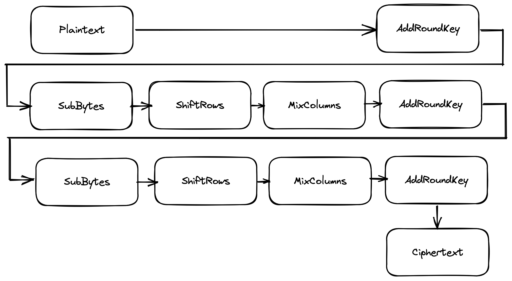
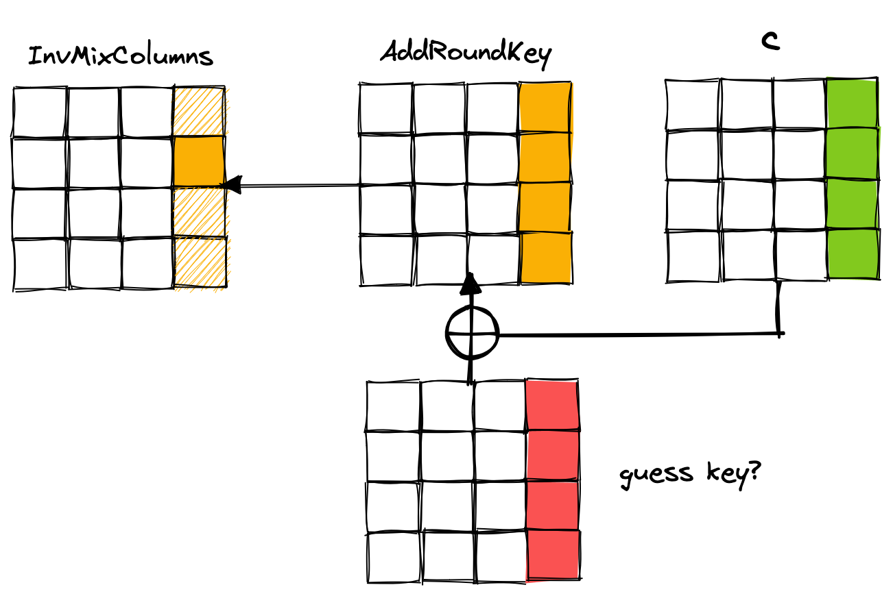

In this article, I want to share my personal learning journey and experience on how I practiced to do cryptanalysis on reduced round AES step by step from the easiest one which is 1-round AES until 3-round AES. 

The attack that we will described here just mainly focus on the differential cryptanalysis of AES S-Box. According to the AES proposal <sup>[[1]](#references)</sup>, it is claimed that AES is resistant against differential cryptanalysis above 4-round. So, how about round below it? Lets find out!

# Preliminaries

Before we dive into the attack, it's good idea to refresh our reference on short preliminaries about AES operations and basic of the attack that we gonna use.

## AES

Advanced Encryption Standard (AES) is the algorithm that was selected by NIST that originally named Rijndael. AES use *Substitution-Permutation Network* (SPN) as its main design. 

AES is 128-bit block cipher which its state represented as byte matrix of size 4x4. It consist of 4 main operations in single round which are `SubBytes`, `ShiftRows`, `MixColumns`, and `AddRoundKey`. 

The number of rounds used in AES depends on the key size, where 128-bit use 10 rounds, 192-bit use 12 rounds, and 256-bit use 14 rounds. In the first round, an additional `AddRoundKey` is used, and in the last round, `MixColumns` operation is omitted.


This is how AES encryption works in nutshell:

```python
def AES(plaintext, master_key, n_rounds=10):

    round_key = key_schedule(master_key)

    state = add_round_key(plaintext, round_key[0])

    for i in range(1, n_rounds):
        state = sub_bytes(state)
        state = shift_rows(state)
        state = mix_columns(state)
        state = add_round_key(state, round_key[i])

    # last round without MixColumns
    state = sub_bytes(state)
    state = shift_rows(state)
    state = add_round_key(state, round_key[n_rounds])

    return state
```

### SubBytes

`SubBytes` will apply substitution mapping on each byte of the state against S-Box. This operation is the only operation in AES that is not linear.


### ShiftRows

`ShiftRows` is the operation that will shift byte position each row to the left depending on the row. Second row will be shifted 1 to the left, third row shifted 2 to the left, and fourth row shifted 3 to the left (first row stay the same).


### MixColumns

The third operation which is `MixColumns` will transform all bytes in the same column by multiply them with the constant 4x4 Matrix over the field $ GF(2^8) $.

$$
\begin{bmatrix}
2 &3 &1 &1\\
1 &2 &3 &1\\
1 &1 &2 &3\\
3 &1 &1 &2
\end{bmatrix}
\begin{bmatrix}
a0\\
a1\\
a2\\
a3
\end{bmatrix}
=
\begin{bmatrix}
b0\\
b1\\
b2\\
b3
\end{bmatrix}
$$


> **NOTE**: we can treat this operation as black box function that transform 4-byte input into another 4-byte output.

### AddRoundKey

The last operation is `AddRoundKey` which simply XOR the state with the `RoundKey`. 


`RoundKey` is the subkey that expanded from `MasterKey` using the Key Schedule function, so it will generate different `RoundKey` on each round of AES. 

We can ignore how the Key Schedule function works since this is irrelevant with our attack. The only thing we must remember here is with any known `RoundKey`, we can recover its `MasterKey` since Key Schedule function is invertible.

## Differential Cryptanalysis

Differential Cryptanalysis is one of the most powerful method to attack block cipher and together with the Linear Cryptanalysis become two *de facto* standard of cryptanalysis against block cipher.

Differential cryptanalysis usually uses bitwise XOR to define the "difference". XOR operation is very useful given the fact that it can "bypass" or skip linear operation on block cipher.

In the context of AES, assume we have the following equation:

$$
c_1 = ARK(MC(SR(p_1))) \\
c_2 = ARK(MC(SR(p_2))) \\
$$

where $ ARK $, $ MC $, and $ SR $ denote `AddRoundKey`, `MixColumns`, and `ShifRows` operation respectively. 

Then, lets assume differential of two plaintext and ciphertext is XOR between these pair that denoted by $ p_1 \oplus p_2 $ and $ c_1 \oplus c_2 $ respectively, then the equation become:

$$
c_1 \oplus c_2 = ARK(MC(SR(p_1 \oplus p_2)))
$$

Since $ ARK $ is just XOR state with the `RoundKey` and both of $ p_1 $ and $ p_2 $ XORed with the same `RoundKey`, we can simplify the equation by removing $ ARK $ at all.

$$
\begin{equation}
\begin{aligned}
c_1 & = MC(SR(p_1)) \oplus RoundKey \\
c_2 & = MC(SR(p_2)) \oplus RoundKey \\
c_1 \oplus c_2 & = MC(SR(p_1 \oplus p_2)) \oplus RoundKey \oplus RoundKey \\
c_1 \oplus c_2 & = MC(SR(p_1 \oplus p_2))
\end{aligned}
\end{equation}
$$

And that's it, we basically already bypass all linear operation even without the knowledge of `RoundKey`. 

> Imagine AES without `SubBytes` operation, then if you know `c1`, `c2`, and `p1`, it is become trivial to recover `p2`, just like what happen in simple XOR cipher.

This way, we only need to focus on one operation that is non-linear which is `SubBytes`. 

Consider $(x, y)$ for every possible byte values. Then, let $\alpha = x \oplus y$ and $\beta = SB(x) \oplus SB(y)$ where $SB$ denotes `SubBytes` operation. We are trying to analyze how many times $\alpha$ and $\beta$ hold.

For example, let $\alpha = 8$ and $\beta = 125$. Over all 256 possible bytes, there are two possible byte pair $(x, y)$ that satisfy the condition which are $(1, 9)$ and $(9, 1)$. 

$$
\begin{equation}
\begin{aligned}
8 & = 1 \oplus 9 = 9 \oplus 1 \\
125 & = SB(1) \oplus SB(9) = SB(9) \oplus SB(1)
\end{aligned}
\end{equation}
$$

So, the probability of ($\alpha$, $\beta$) being $(1, 8)$ are 2/256. 

And that is what Differential Cryptanalysis is all about, we find the probability of input differential ($\alpha$) that will resulting to the specific output differential ($\beta$) through S-BOX.

## Differential in AES S-box

In order to find differential property of S-Box, we must first find the distribution of the differences between pairs of input and pairs of output values. This can be achieved from S-Box **Differential Distribution Table** (DDT), which is the table that shows the number of occurences every possible input difference that results in coresponding output difference.

S-Box DDT can be quickly built with the following Python code:

```python

SBOX = [...] # 1D list of AES S-Box

def generate_sbox_ddt():
    table = [[]] * 256
    for i in range(256):
        for j in range(256):
            diff_input = i ^ j
            diff_output = SBOX[i] ^ SBOX[j]

            if len(table[diff_input]) != 0:
                table[diff_input][diff_output] += 1
            else:
                table[diff_input] = [0] * 256
                table[diff_input][diff_output] = 1

    return table
```

If we look closely on the S-Box DDT result, each row of table have kind of similar occurence distribution where it contains either 0 or 2 and one time occurence of 4 (except the first row where input equal to zero).

Below is the sample of the result showing 2nd and 65th row:

```
[0, 2, 0, 0, 2, 0, 2, 0, 2, 2, 2, 2, 2, 2, 2, 2, 0, 2, 0, 0, 2, 2, 0, 0, 2, 2, 2, 0, 0, 0, 2, 4, 0, 2, 2, 0, 2, 0, 0, 0, 0, 2, 2, 0, 0, 2, 0, 2, 2, 2, 0, 0, 0, 2, 2, 2, 2, 2, 2, 2, 0, 0, 0, 2, 0, 0, 0, 2, 0, 0, 0, 2, 2, 0, 2, 2, 2, 0, 2, 2, 0, 2, 0, 2, 2, 0, 0, 0, 2, 2, 2, 0, 0, 0, 0, 0, 0, 0, 2, 2, 0, 2, 0, 0, 0, 2, 2, 2, 2, 0, 2, 0, 0, 0, 2, 0, 0, 2, 0, 0, 2, 2, 0, 0, 0, 2, 0, 0, 2, 0, 2, 2, 2, 2, 0, 2, 0, 2, 2, 0, 0, 0, 2, 0, 0, 2, 0, 2, 0, 0, 0, 2, 0, 2, 0, 2, 0, 2, 0, 2, 0, 2, 0, 2, 0, 0, 2, 0, 2, 2, 2, 2, 2, 2, 0, 0, 2, 0, 2, 0, 2, 2, 2, 2, 0, 0, 2, 0, 2, 0, 0, 0, 0, 2, 2, 2, 0, 0, 0, 2, 2, 0, 2, 0, 2, 2, 2, 2, 2, 0, 2, 2, 0, 0, 0, 0, 2, 0, 0, 0, 2, 2, 0, 0, 2, 2, 0, 0, 2, 0, 0, 2, 0, 0, 2, 0, 0, 2, 2, 2, 0, 0, 2, 0, 0, 0, 2, 2, 2, 0, 2, 2, 0, 0, 0, 2]

[0, 2, 0, 0, 0, 2, 0, 0, 0, 0, 2, 2, 2, 0, 0, 2, 2, 0, 2, 0, 0, 2, 2, 0, 0, 0, 0, 2, 2, 0, 2, 2, 2, 2, 2, 0, 0, 0, 0, 2, 0, 2, 2, 2, 2, 2, 2, 2, 0, 2, 2, 2, 2, 2, 2, 0, 0, 2, 2, 0, 0, 2, 0, 0, 0, 2, 0, 2, 0, 2, 0, 0, 0, 2, 0, 0, 2, 0, 0, 0, 0, 0, 0, 2, 0, 2, 0, 0, 2, 2, 2, 2, 2, 0, 0, 2, 2, 2, 2, 2, 2, 2, 2, 2, 0, 2, 4, 2, 0, 0, 0, 2, 0, 2, 2, 0, 2, 2, 0, 2, 0, 0, 2, 0, 0, 0, 0, 0, 0, 0, 0, 0, 2, 0, 2, 0, 0, 0, 2, 2, 0, 0, 2, 0, 2, 0, 2, 0, 0, 0, 2, 0, 2, 2, 0, 0, 0, 0, 0, 2, 0, 0, 2, 0, 2, 2, 2, 2, 0, 0, 2, 2, 0, 2, 2, 0, 0, 2, 0, 0, 0, 0, 0, 0, 0, 0, 2, 2, 0, 2, 2, 2, 2, 2, 2, 2, 2, 0, 0, 2, 2, 2, 2, 0, 2, 2, 0, 2, 0, 2, 0, 0, 0, 2, 2, 2, 2, 2, 2, 2, 0, 2, 0, 2, 2, 0, 0, 0, 2, 2, 0, 2, 2, 2, 0, 0, 0, 0, 0, 2, 2, 0, 2, 0, 0, 0, 2, 0, 0, 2, 2, 2, 0, 0, 0, 2]
```

If we try to count those, we will find that on each row (except 1st row), 0 appears 129 times, 2 appears 126 times, and 4 appears 1 time.

Lets consider $ (\alpha, \beta) $ as input and output difference pairs of single AES S-box and $ \alpha \neq 0 $. Then we have following observation based from the S-Box DDT:

- For 129/256 of possible pairs $ (\alpha, \beta) $, there is no such pair $ (x, y) $ that $ x \oplus y = \alpha $ and $ SB(x) \oplus SB(y) = \beta $
- For 126/256 of possible pairs $ (\alpha, \beta) $, there exist two pairs $ (x, y) $ such that $ x \oplus y = \alpha $ and $ SB(x) \oplus SB(y) = \beta $
- For 1/256 of possible pairs $ (\alpha, \beta) $, there exist four pairs $ (x, y) $ such that $ x \oplus y = \alpha $ and $ SB(x) \oplus SB(y) = \beta $

From the above observation, can be implied that if we know a pair of $ (\alpha, \beta) $ then we can quickly recover $ (x, y) $ which is the actual input/output value of the S-Box <sup>[[2]](#references)</sup>.

# 1 Round AES


Let's start breaking 1 round AES with the differential cryptanalysis!

Consider $ (p_1, c_1) $ and $ (p_2, c_2) $ are plaintext-ciphertext pairs of 1-round AES, where all these values are known to us and we want to find the `MasterKey` (known-plaintext scenario). 

Let differential of $ (p_1, p_2) $ denoted by $ \alpha $ and differential of $ (c_1, c_2) $ denoted by $ \beta $.


We then apply $ MC^{-1} $ and $ SR^{-1} $ to $ \beta $. Now we have one-on-one byte relation of $ \alpha $ and $ \beta $ through S-Box.


Then, consider $x$ and $y$ where we try all possible values until they satisfy following conditions:
- $ x \oplus y \neq 0 $
- $ x \oplus y = \alpha $
- $ SB(x) \oplus SB(y) = \beta $. 

According to the differential observation that explained before, it should exist two possible pairs $ (x, y) $ that satisfy those conditions.

Alternatively, we can optimize our finding of possible $(x, y)$ value using S-Box DDT that we built previously. This way, we can just do table lookup of $\alpha$ and $\beta$ to quickly find possible $(x, y)$ instead of using brute-force. But, we need to slightly modify our S-Box DDT to store the actual value of $(x, y)$ instead of the number of occurence.

Below is the Python implementation that generate S-Box DDT lookup:

```python
SBOX = [...] # 1D list of AES S-Box

def generate_sbox_ddt():
    table = [[]] * 256
    for i in range(256):
        for j in range(256):
            diff_input = i ^ j
            diff_output = SBOX[i] ^ SBOX[j]

            if len(table[diff_input]) != 0:
                table[diff_input][diff_output].update(set([i, j]))
            else:
                table[diff_input] = [set() for _ in range(256)]
                table[diff_input][diff_output] = set([i, j])

    return table

ddt = generate_sbox_ddt()

# Lookup the table
alpha = ... 
beta = ...
possible_xy = ddt[alpha][beta]
```

Okay, so what's next after we found the value of $(x, y)$ ?

Remember that before round 1, there is additional `AddRoundKey` before the very first `SubBytes` operation. So, the value of $(x, y)$ is the value of either $ARK(p_1)$ or $ARK(p_2)$. Thus, we can find possible $RK_0$ by simply XORing $x$ or $y$ with the respective byte of $p_1$ or $p_2$. 


Thats it! We can iterate this process for all byte position of $RK_0$. Note that there will always be 2 possible values for each byte position of $RK_0$ (except the differential is zero), so we can do trial encryption/decryption with the obtained possible key to get the correct key with only $2^{16}$ trials.

> **NOTE:** Because we already found `RoundKey` of round 0, we don't need to reverse the key expansion since this `RoundKey` is already equal to the AES `MasterKey`

# 2 Round AES



Can we extend our previous attack to make it works against 2 round AES?

Consider $ (p_1, c_1) $ and $ (p_2, c_2) $ are plaintext-ciphertext pairs of 2-round AES and $(\alpha, \beta)$ are input-output difference pairs of $(p_1, p_2)$ and $(c_1, c_2)$ respectively.

If we illustrate this scenario into 2-round AES, we can bypass first `AddRoundKey` and `ShiftRows` by swapping operation order with `SubBytes`. Then, in the last round, we can bypass `ShiftRows`, `MixColumns`, and `AddRoundKey`. So, the view become $\alpha \circ SB \circ MC \circ ARK \circ SB \circ \beta$.

Unfortunately, there are already too many operation between `SubBytes` that will significantly mess our differential distribution. Moreover, `MixColumns` will also prevent us to work on one-on-one byte relation, since this operation works on 4-bytes at once. This is already too much and too complex. Thus, we need different strategy that much more simple. 

The key point here is that we can only "bypass" `SubBytes` with differential **once** at a time. But then, there are two `SubBytes` in 2-round AES, how can we bypass the other one?

### Half Last Round

To simplify our understanding of the attack, lets first assume that last round does not make use of `MixColumns` (usually called half round). So, in the round 2, the operation flow is only $SB \circ SR \circ ARK$.

Let $\alpha$ be differential of plaintext $(p_1, p_2)$ where only the first column has **active** byte, which is byte with non-zero differential. Any other value should be zero differential or **inactive** byte. Since we need this spesific plaintext value, so this attack only applicable in chosen-plaintext scenario.


Then, send $(p_1, p_2)$ to the encryption oracle which will give us corresponding $(c_1, c_2)$.

If we remember our previous differential observation, there are 129/256 probability that differential input/output is impossible. Instead of using possible pair of differential, we will use the opposite which is the impossible pair. We can use this property as distinguisher whether our state is in correct state or not.

So, the main idea here is to generate all *impossible* state at the start of round 2 just before second `SubBytes` using $\alpha$. First, we want to bypass `SubBytes` using S-Box DDT like our previous attack on 1-round. But here, instead of finding possible S-Box output differential, we want to find impossible S-Box output differential. This will result in 129 impossible byte for each $\alpha$ denoted by $\mathbf{S} = (S_1, \ldots, S_{129})$. Then, for each $S_i$ we apply $SR$, $MC$ and store this state to the list of impossible state.


> If we look at the image above, our impossible state is spreaded to all byte position despite only using 4-bytes. That is the main reason why we put active byte only on the same column.

Then, we will guess one byte of $RK_2$ for every possible values and inverse the pair of ciphertext $(c_1, c_2)$ through $ARK$, $SR^{-1}$, and $SB^{-1}$ independently. Finally, we create differential of inversed $(c_1, c_2)$ denoted by $\beta$ and compare with our generated impossible state. If $\beta$ exist in the impossible state, then we know that our guess key is incorrect and we add it to the list of impossible key.


The remaining key that is not discarded to the list of impossible key should be the correct possible key. We just need to repeat this process to the other byte position.

But, there is still one problem, that is if we only use one $\alpha$, it is not enough to discard most of the impossible key. From my experiment, single $\alpha$ will only find about 110-140 impossible keys. So, we need more $\alpha$ which means more chosen-plaintext pairs. The ideal number of $\alpha$ required would be about ~10 to discard almost all of the impossible keys.

> **NOTE**: using two $\alpha$ doesn't mean we will find ~250 impossible keys, since most keys found will be duplicate to each other.

After we discard almost all of the impossible keys, we still need to inverse the key from $RK_2$ to $RK_0$ which is the `MasterKey`. How we perform inverse Key Schedule is outside this article scope and will not be explained here. If you want to learn how to do it, you can take a look on my [source code](https://github.com/Merricx/aes-attack/blob/main/utils.py#L134) or probably implement yourself :D

Finally, we can enumerate the remaining possible key using trial encryption/decryption like our previous attack. This should only take less than $2^{6}$ trials if we use ~10 $\alpha$.

### Full Last Round

Now, as we successfully broke 2-round AES with half last round, how will we do it in the full last round?

If we re-illustrate the attack flow into full round scenario, we need 4-byte guess at once to bypass `InvMixColumns` operation and this alone already significantly increase time complexity from $2^{8}$ to $2^{32}$.



Fortunately, there is one property in AES to overcome this problem. Remember that both of `MixColumns` and `AddRoundKey` are linear operation and these operation hold the following equation:

$$
\begin{equation}
\begin{aligned}
ARK(MC(p)) & = MC(p) \oplus RoundKey \\
& = MC(p) \oplus MC(MC^{-1}(RoundKey)) \\
& = MC(p \oplus MC^{-1}(RoundKey)) \\
\end{aligned}
\end{equation}
$$

Which means we can swap the order operation of `MixColumns` with `AddRoundKey` as well as `AddRoundKey` with `InvMixColumns`.

$$
\begin{equation}
\begin{aligned}
MC^{-1}(ARK(c)) = MC^{-1}(c) \oplus MC^{-1}(RoundKey)
\end{aligned}
\end{equation}
$$

So, we can apply $MC^{-1}$ on our $c$ before $ARK$ as long as we also apply $MC^{-1}$ to the $RK_2$. But, we don't really care about updating $RK_2$ right now. We just need to apply $MC$ later when we got all bytes of the possible keys.


Thats it! There is no other difference with how we attack half round.

# 3 Round AES


Good news! We can actually extend our previous attack to work against 3-round AES. We can think this as "2-round AES with additional round at the beginning".

Let $\alpha$ be differential of plaintext $(p_1, p_2)$ where only the **first** byte has active byte, the rest are inactive. If we illustrate this state and go through first round transformation, the state will end up exactly as the state in the first round of 2-round attack.


Okay, so the only problem now is how can we bypass this `SubBytes` in the first round?

We can guess one byte of $RK_0$ for every possible values denoted by $GK_0$ and then apply 1 round transformation to the plaintext $(p_1, p_2)$ through $ARK$, $SB$, $SR$, and $MC$ independently (note that we apply $ARK$ of round 0, instead of round 1). After that, we create differential of transformed $(p_1, p_2)$ denoted by $\alpha$ and finally we are in the same situation as the previous 2-round attack.


From here, the flow is relatively same as 2-round attack where we generate bunch of impossible state from $\alpha$ through second round resulting the list of impossible state.

Then, we guess another one byte of $RK_3$ denoted by $GK_3$, inverse pair of ciphertext $(c_1, c_2)$ in the third round through $MC^{-1}$, $ARK$, $SR^{-1}$, $SB^{-1}$ independently and create differential from those pair denoted by $\beta$. Compare $\beta$ with the impossible state, if $\beta$ exist in one of the impossible state, we add $GK_3$ to the list of impossible key. 

We can determine whether $GK_0$ is the correct guess or not by looking at the number of $GK_3$ that added to the impossible keys. If in any byte position, impossible keys contain all possible bytes, then $GK_0$ is incorrect, otherwise $GK_0$ is correct.

After impossible keys of all byte position in $RK_3$ discarded, we enumerate the remaining key, apply $MC$ and perform inverse key schedule to reverse $RK_3$ to $RK_0$ and check if the key is correct via trial encryption/decryption.

Although the chosen-plaintext required in this attack is the same with the previous attack (~10 $\alpha$), the time complexity in this attack is at least $2^8$ times higher than the previous attack since we guess 2 bytes at a time. Moreover, for each guess of $GK_0$, we need to regenerate the impossible state again. But this attack is still quite fast and running this on my laptop only take less than 5 minutes on average.

# Conclusion

That's all, we successfully broke 1-round AES until 3-round AES with differential cryptanalysis. We start ourselves looking at the differential property of AES S-Box and then able to exploit those property to recover the key round by round. 

Although there are many of more sophisticated and more advanced attacks on higher round, AES is still remain secure in full round. 

Lastly, all python implementation of these attacks can be found [here](https://github.com/Merricx/aes-attack).

# References

1. Daemen, J. & Rijmen, V. (1998). AES Proposal: Rijndael, NIST AES proposal.

2. Bouillaguet, C., Derbez, P., Dunkelman, O., Keller, N., Rijmen, V., & Fouque, P.-A. (2010). Low Data Complexity Attacks on AES. Cryptology ePrint Archive, Paper 2010/633. https://eprint.iacr.org/2010/633