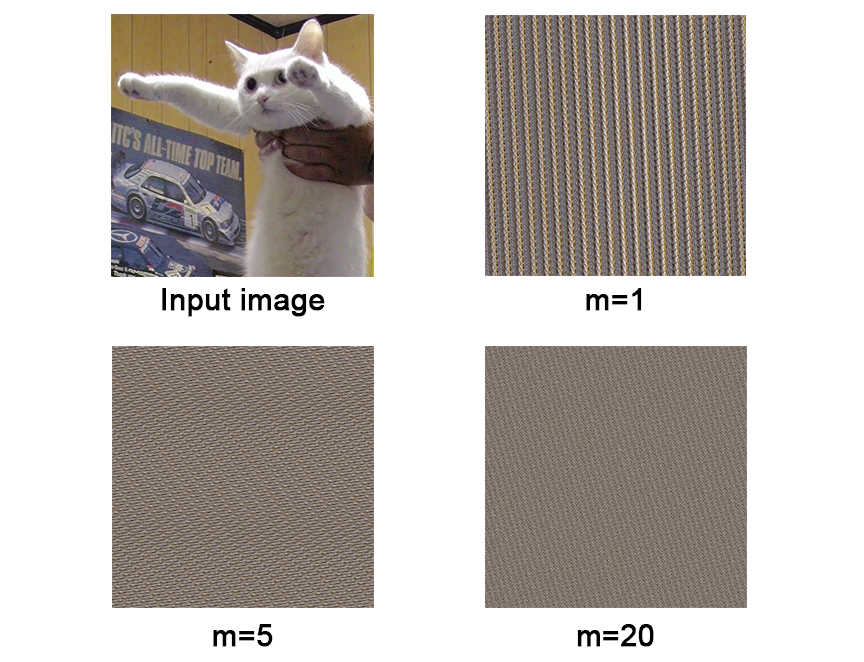
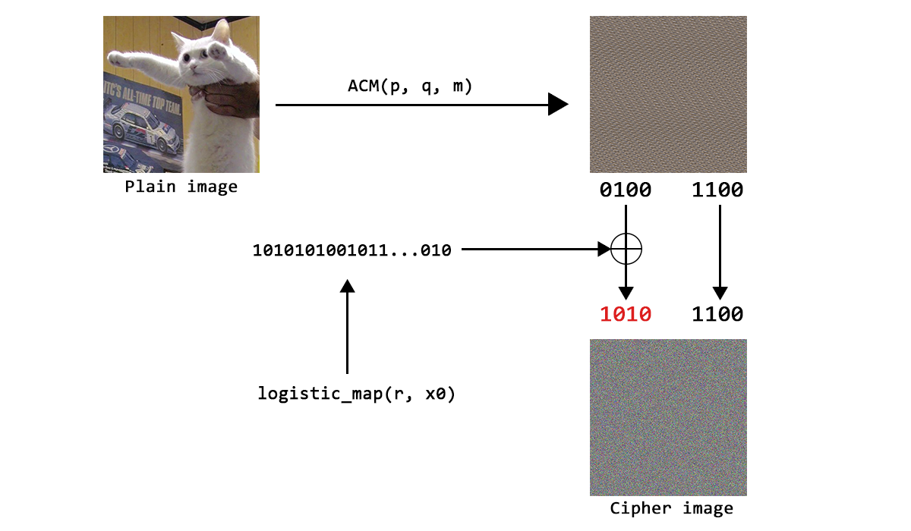

# Introduction

Ini adalah sebuah *series* dimana saya akan mencoba melakukan kriptanalisis terhadap skema kriptosistem yang diusulkan pada berbagai jurnal, *paper*, maupun artikel akademis dari beberapa Universitas di Indonesia.

Tulisan ini hanya berusaha menekankan pada kalimat *"Don't roll your own Crypto"*, dimana lebih baik kita menggunakan algoritma kriptografi yang sudah distandarisasi dibandingkan merancang algoritma sendiri yang belum terbukti keamanannya.

Ini bukan berarti saya meng-*encourage* akademisi untuk tidak mengusulkan algoritma sendiri ya, tapi ini lebih ditargetkan kepada *developer* atau pelaksana dalam IT *security* untuk tidak sembarangan memilih atau merancang sebuah kriptosistem. 

Selain itu, tulisan ini juga tidak ada niatan sama sekali untuk merendahkan penelitian-penelitian yang berkaitan. Bagaimanapun juga, memang seperti inilah proses pengusulan sebuah skema kriptosistem dilakukan, dimana ada satu pihak mengusulkan ide, pihak-pihak lainnya akan mencoba mencari kelemahan dari ide tersebut, hingga akhirnya dari kelemahan-kelemahan tersebut dapat dikembangkan menjadi skema yang lebih baik lagi dan begitu seterusnya.

# Chaos-based Image Encryption

Skema kriptosistem yang akan dibahas di seri pertama kali ini adalah penelitian dari artikel yang berjudul **"ANALISIS KEAMANAN ALGORITMA ENKRIPSI CITRA DIGITAL MENGGUNAKAN KOMBINASI DUA CHAOS MAP DAN PENERAPAN TEKNIK SELEKTIF"** oleh Rinaldi Munir, yang dipublikasikan oleh Jurnal Ilmiah Teknologi Informasi (JUTI) pada tahun 2012 <sup>[[1]](#references)</sup>.

Artikel tersebut membahas mengenai algoritma enkripsi gambar dengan memanfaatkan dua fungsi *Chaos*, yaitu *Arnold Cat Map* sebagai fungsi permutasi dan *Logistic Map* sebagai pembangkit *keystream*.

Selain itu, dijelaskan juga penggunaan **"enkripsi selektif"** dimana enkripsi hanya dilakukan pada 4-bit awal (*Most Significant Byte*) saja, sedangkan 4-bit akhir (*Least Significant Byte*) pada gambar (setelah dipermutasi) tidak akan berubah.

## Arnold's Cat Map

**Arnold's Cat Map** (ACM) adalah fungsi *Chaos Map* untuk mengacak posisi pixel-pixel (dalam koordinat `x` dan `y`) pada sebuah gambar.

Persamaan ACM yang dipakai dalam artikel tersebut adalah sebagai berikut.

$$
    \begin{bmatrix}
    x' \\
    y' \\
    \end{bmatrix}
    =
    \begin{bmatrix}
    1 & p \\
    q & pq + 1 \\
    \end{bmatrix}
    \begin{bmatrix}
    x \\
    y \\
    \end{bmatrix}
    \mod N
$$

Dimana `(x,y)` adalah posisi pixel awal dan `(x',y')` adalah posisi pixel setelah dipermutasi. Sementara itu, nilai `N` adalah ukuran panjang dari gambar. Fungsi ini akan dijalankan sebanyak `m` kali.

Jadi, *secret variable* yang ada pada fungsi ACM terdiri dari `p`, `q`, dan `m`.

Berikut adalah visualisasi gambar setelah dilakukan fungsi ACM beberapa kali, terlihat semakin tinggi nilai `m`, semakin terlihat acak hasil posisi pixel-nya.



Untuk membalik proses ACM, kita cukup mengkalikan `(x',y')` dengan invers matriks $ \begin{bmatrix} 1 & p\\ q & pq+1\\ \end{bmatrix} $.

## Logistic Map

**Logistic Map** adalah fungsi *Chaos Map* yang dihasilkan dari persamaan non-linear sederhana berikut.

$$
x_{i+1} = r x_i \left(1 - x_i\right)
$$

Dimana didefinisikan `r` sebagai konstanta bilangan real dalam interval 0 hingga 4 dan `x0` sebagai nilai awal acak dalam interval 0 hingga 1. Kedua variabel ini dirahasiakan nilainya.

Untuk membangkitkan *keystream* menggunakan *Logistic Map*, cukup kalkulasikan persamaan diatas yang menghasilkan `x1, x2, x3, ...` hingga panjang *keystream* yang dibutuhkan terpenuhi. Nilai pada `x1, x2, x3, ...` masing-masing merepresentasikan 4-bit kunci yang diambil dari nilai dibelakang koma.

Misalnya dihasilkan deretan dari Logistic Map yaitu `0.5, 0.875, 0.3828125, 0.8269348, ...`, maka diambil beberapa angka dibelakang koma menjadi `5, 875, 3828, 8269, ...`, ubah masing-masing ke *binary* dan ambil 4-bit terakhir (LSB) menghasilkan *keystream* `0101, 1011, 0100, 1101, ...`.

## Encryption

Tahapan enkripsinya secara singkat adalah sebagai berikut.



1. Inisialisasi *Plain image* `P`, variabel `p`, `q`, `m`, `r`, dan `x0` sebagai kunci rahasia.
2. Permutasi gambar `P` dengan fungsi ***Arnold Cat Map*** bersama parameter `p`, `q`, dan `m`, menghasilkan gambar `Px`.
3. Gunakan ***Logistic Map*** untuk membangkitkan *keystream* `K` menggunakan konstanta `r` dan nilai awal `x0`.
4. Enkripsi 4-bit MSB tiap pixel pada `Px` dengan *keystream* `K` menggunakan operasi XOR, menghasilkan 4-bit `Cx` setiap pixelnya.
5. *Cipher image* `C` yang didapatkan adalah gabungan hasil enkripsi 4-bit `Cx` dengan 4-bit LSB pada gambar `Px`.


Implementasi enkripsi ini menggunakan Python dapat dilihat pada <a href="https://github.com/Merricx/chaos-image-encryption/blob/main/encryption.py" target="_blank">source disini</a>

# Cryptanalysis

Langsung saja kita coba lakukan kriptanalisis pada skema enkripsi gambar ini :D.

Dalam melakukan kriptanalisis, akan diasumsikan beberapa skenario implementasi dikarenakan dalam artikel tersebut tidak didefinisikan spesifikasi bagaimana implementasi seharusnya dilakukan. 

Model kriptanalisis yang akan kita gunakan adalah *Chosen-Plain image Attack*, dimana kita dapat mengenkripsi gambar apapun yang kita mau sebanyak-banyaknya dan mendapatkan hasil *Cipher image* dari gambar tersebut.

## Static Secret Key

Diasumsikan skenario implementasi dimana *secret key* yang terdiri variabel `p`, `q`, `m`, `r`, dan `x0` bersifat statis dimana nilainya tidak berubah dalam eksekusi enkripsi yang berbeda. 

### Recovery of Keystream

Dikarenakan nilai `r` dan `x0` selalu sama, hasil dari *Logistic Map* juga akan menghasilkan *keystream* yang sama juga.

Seperti pada *stream cipher* dimana *keystream* tidak boleh digunakan berulang kali, disini *keystream* (`K`) dapat di-*extract* dengan mudah selama kita mengetahui *plain image* yang telah dipermutasi dengan ACM (`Px`) dan *cipher image*-nya (`C`).

$$
C = Px \oplus K \\
K = C \oplus Px
$$

Namun disini kita tidak mengetahui nilai dari `Px` (hanya 4-bit LSB-nya saja yang diketahui) karena kita tidak diberikan parameter `p`, `q`, dan `m` pada ACM.

*Well*, karena ini adalah *Chosen-Plain image Attack* dan kita dapat mengenkripsi gambar apapun, kita tinggal gunakan *Plain image* yang mempunyai nilai sama disemua pixel-nya seperti gambar full hitam atau gambar full putih. 

Karena semua nilai pixel pada gambar tersebut sama, maka permutasi ACM akan menghasilkan gambar yang sama juga, sehingga otomatis kita mengetahui nilai `Px`, lalu tinggal cari nilai *keystream* dengan operasi XOR ¯\\\_(ツ)\_/¯

Setelah *keystream* didapatkan, mari kita cari nilai `p`, `q`, dan `m`.

### Recovery of `m`

Perlu diketahui jika proses fungsi ACM sebenarnya cukup *costly* dalam sisi hardware, dimana dalam satu iterasi ACM saja (`m=1`) membutuhkan waktu yang tidak sebentar, sehingga perbedaan nilai `m` dengan `m+1` cukup *noticable*. 

Hal ini cukup berbahaya karena kita dapat mengetahui nilai `m` dari ***Timing Attack***. Semakin tinggi nilai `m` yang digunakan, maka waktu yang dibutuhkan dalam operasi ACM akan memakan waktu lebih lama.

Terlebih, *Timing Attack* pada nilai `m` dapat dibuat sangat akurat dengan memakai ukuran gambar yang sangat besar, sehingga proses ACM pada satu iterasi `m` sangat besar.

Berikut adalah tabel hasil tes waktu yang dibutuhkan pada proses ACM menggunakan `m = 1` hingga `m = 5` pada gambar berukuran 1024x1024 menggunakan Laptop saya.

| m  | Waktu (detik) |
|----|---------------|
| 1  | 7.1236        |
| 2  | 13.8878       |
| 3  | 21.7516       |
| 4  | 27.8001       |
| 5  | 35.2292       |

Dapat dilihat pada tabel tersebut bahwa waktu yang dibutuhkan relatif konsisten pada kelipatan 7 detik. Dari hal ini kita dapat menebak nilai `m` hanya dari waktu yang dibutuhkan dalam mengenkripsi gambar.

Sebenarnya dari awal, merahasiakan nilai `m` disini tidak relevan, karena bagaimanapun rentang nilai `m` tidak mungkin terlalu tinggi karena akan membawa *performance issue* pada enkripsinya jika terlalu tinggi. Jadi, kita pun dapat melakukan *simple brute-force* pada nilai `m`.

### Recovery of `p` and `q`

Dengan didapatkannya nilai `m`, maka mencari `p` dan `q` cukup *trivial*.

Idenya adalah kita akan membuat sebuah *Plain image* yang semua pixelnya memiliki nilai warna hitam (0), kecuali pada satu koordinat saja memiliki warna putih (255) atau nilai selain 0. 

Misalnya, kita tentukan pada koordinat `(1, 0)`, maka *Plain image* yang berukuran 4x4 dapat direpresentasikan sebagai matrik berikut.

$$
\begin{pmatrix}
0 & 255 & 0 & 0 \\
0 & 0 & 0 & 0 \\
0 & 0 & 0 & 0 \\
0 & 0 & 0 & 0 \\
\end{pmatrix}
$$

Masukkan *plain image* tersebut ke *encryption oracle*, didapatkan *cipher image*, dekripsi menggunakan *keystream* yang sudah kita dapatkan sebelumnya, sehingga kita memiliki *plain-image* yang telah dipermutasi.

Misalnya *plain image* yang dipermutasi tersebut adalah berikut.

$$
\begin{pmatrix}
0 & 0 & 0 & 0 \\
0 & 0 & 0 & 0 \\
0 & 0 & 0 & 0 \\
0 & 0 & 255 & 0 \\
\end{pmatrix}
$$

Maka dapat kita simpulkan koordinat kita sebelumnya dari `(1, 0)` berpindah ke koordinat `(2, 3)`.

Mari kita asumsikan nilai `m = 3`, maka persamaan ACM seperti yang dijelaskan sebelumnya menjadi berikut.

$$
    \begin{bmatrix}
    2 \\
    3 \\
    \end{bmatrix}
    =
    \begin{bmatrix}
    1 & p \\
    q & pq + 1 \\
    \end{bmatrix}^3
    \begin{bmatrix}
    1 \\
    0 \\
    \end{bmatrix}
    \mod N
$$

Kemudian dapat kita tuliskan menjadi:

$$
\begin{equation}
\begin{aligned}
2 &\equiv \left( \left( p \cdot q + 1 \right) \cdot p + p \right) \cdot q + p \cdot q + 1 \pmod{N} \\ 
3 &\equiv \left( \left( p \cdot q + 1 \right)^2 + p \cdot q \right) \cdot q + \left( p \cdot q + 1 \right) \cdot q + q \pmod{N}
\end{aligned}
\end{equation}
$$

Dimana nilai `p` dan `q` dapat dicari dengan menyelesaikan sistem persamaan linear dua variabel (dengan modulus `N`).

Akhirnya, dengan diketahui *keystream* `K`, nilai `p`, `q`, dan `m` pada ACM, kita dapat mendekripsi gambar apapun yang terenkripsi dibawah *secret key* ini :).

### Proof of Concept

Mari kita buktikan dengan mengimplementasikannya kedalam Python.

Pertama, kita buat fungsi `encryption_oracle()` yang seolah-olah akan berperan sebagai "server" dimana kita dapat mengenkripsi gambar apapun ke "server" tersebut dan menerima *cipher image*-nya.

```python
import random, os
import numpy as np
import encryption
from PIL import Image
from Crypto.Util.strxor import strxor

# Secret
p = random.randint(2,250)
q = random.randint(2,250)
m = 3
init = random.random()
r = 3 + random.random()

def encryption_oracle(plain_image):

    return encryption.encrypt(plain_image, p, q, m, init, r)
```

Lalu, buat fungsi `recover_keystream` untuk mendapatkan *keystream* dari *chosen-plain image attack*.

```python
def recover_keystream(size):

    # Generate full-black image
    plain_image = Image.new("RGB", (size, size))

    # Send image to encryption oracle
    cipher_image = encryption_oracle(plain_image)

    # Convert plain_image and cipher_image to bytes
    plain_image_bytes = bytes(np.array(plain_image).flatten().tolist())
    cipher_image_bytes = bytes(np.array(cipher_image).flatten().tolist())

    # Recover 8-bit keystream
    k = list(strxor(plain_image_bytes, cipher_image_bytes))

    # Get 4-bit MSB keystream
    keystream = []
    for i in range(size**2):
        bit_len = int(k[i]).bit_length()
        if bit_len > 4:
            msb = k[i] >> 4 & (2**(bit_len-4) - 1)
        else:
            msb = 0
        
        keystream.append(msb)
    

    return keystream
```

Lalu, buat fungsi untuk mendapatkan `m` melalui *Timing Attack*.

```python
def recover_m():
    # avg. second of one encryption execution time (depends on the machine)
    one_exec_time = 10 

    start_time = time.time()
    payload = Image.new("RGB", (1024, 1024))

    encryption_oracle(payload)

    end_time = time.time()
    elapsed_time = end_time - start_time
    m = int(elapsed_time // one_exec_time)

    # Result could be faster or slower
    possible_m = [m, m-1, m+1]

    return possible_m
```

Terakhir, untuk mendapatkan nilai `p` dan `q`, kita akan menggunakan ***Sagemath*** dan menggunakan fungsi `solve_mod()` untuk menyelesaikan sistem persamaan yang dijelaskan sebelumnya.

```python
#!/usr/bin/env sage
def recover_pq(m, x0, y0, x1, y1, N):

    var('p,q')
    xy = matrix(2,1,[x0,y0])
    A = matrix([[1,p],[q, p*q + 1]])

    pos_result = solve_mod([
        (A^m * xy)[0][0] == x1,
        (A^m * xy)[1][0] == y1
        ], N)

    return pos_result

if __name__ == "__main__":

    m = 7 # ACM iteration
    x0 = 1
    y0 = 0
    x1 = 489 # x-coordinate after permutation
    y2 = 396 # y-coordinate after permutation
    N = 512 # image size

    print("Possible p,q: ")
    print(recover_pq(m, x0, y0, x1, y2, N))
```

Implementasi lengkapnya dapat diakses di [link ini](https://github.com/Merricx/chaos-image-encryption).

## Static Secret Key with Dynamic `x0`

Skenario implementasi berikutnya adalah jika diasumsikan variabel `p`,`q`,`m`,`r` bersifat statis namun variabel `x0` dinamis, dimana nilai ini akan berubah-ubah dalam eksekusi enkripsi yang berbeda. 

Skenario ini adalah skenario yang paling ideal yang dapat diimplementasikan pada skema kriptosistem ini, karena *repeated keystream* sudah tidak terjadi.

Namun, yang menjadi masalah adalah bagaimana nilai `x0` ini dapat terbentuk dan terasosiasi disetiap gambar yang berbeda. Salah satu pendekatan yang mungkin dilakukan adalah dengan memperlakukan `x0` ini seperti *Initialization Vector* (IV) seperti pada *block cipher*. Tapi, nilai ini harus tetap dienkripsi lagi dengan metode tertentu dan dicantumkan di setiap gambar yang telah terenkripsi menggunakan nilai tersebut. 

Kita abaikan saja teknis bagaimana nilai `x0` didistribusikan. Asumsi kita pada skenario ini adalah untuk setiap *request* ke *encryption oracle*, nilai `x0` akan berubah-ubah dan bersifat acak.

Karena *repeated keystream* sudah tidak bisa dieksploitasi, maka akan sulit untuk kita mendapatkan *keystream* dari *chosen-plain image attack*, karena *basically* enkripsi ini menjadi *One-Time Pad*.  

### Recover ACM secret

Lalu bagaimana kita dapat mencari nilai `p` dan `q` tanpa mengetahui *keystream* yang digunakan?

Disinilah celah keamanan dari penggunaan "**enkripsi selektif**" terjadi, dimana *cipher image* membocorkan informasi dari LSB *plain image*-nya.

Asumsikan kita menggunakan *chosen-plain image* yang direpresentasikan sebagai berikut.

$$
\begin{pmatrix}
0 & 255 & 0 & 0 \\
0 & 0 & 0 & 0 \\
0 & 0 & 0 & 0 \\
0 & 0 & 0 & 0 \\
\end{pmatrix}
$$

Masukkan *plain image* tersebut ke *encryption oracle*. Kemudian, dimisalkan didapatkan *cipher image* sebagai berikut.

$$
\begin{pmatrix}
32 & 96 & 176 & 32 \\
112 & 240 & 112 & 144 \\
32 & 95 & 192 & 80 \\
176 & 208 & 48 & 160 \\
\end{pmatrix}
$$

Kita ubah masing-masing pixel ke representasi *binary* dan boom!! *LSB oracle goes brrrr!*

$$
\begin{pmatrix}
00100000 & 01100000 & 10110000 & 00100000 \\
01110000 & 11110000 & 01110000 & 10010000 \\
00100000 & 01011111 & 11000000 & 01010000 \\
10110000 & 11010000 & 00110000 & 10100000 \\
\end{pmatrix}
$$

Karena skema enkripsi selektif tersebut, kita masih mengetahui posisi koordinat pixel kita setelah dipermutasi karena 4-bit LSB dari *plain image* tidak pernah berubah (cukup perhatikan 4-bit LSB yang tidak bernilai `0000`).

Tinggal lanjutkan menggunakan metode yang sama seperti skenario sebelumnya dengan menyelesaikan sistem persamaan dua variabel untuk mendapatkan nilai `p` dan `q` (nilai `m` masih bisa didapatkan melalui *Timing Attack*).

Selanjutnya, bagaimana kita dapat mencari nilai *keystream* yang dinamis? Sedangkan *One-Time Pad* merupakan *unbreakable cipher*.

### Weak Logistic Map

Satu-satunya hal yang bisa kita coba eksploitasi adalah dari implementasi *Logistic Map*-nya.

Analisis mengenai bagaimana *Logistic Map* bekerja dijelaskan secara detail oleh blog dari <u>geoffboeing.com</u> <sup>[[2]](#references)</sup>. Menariknya, ada beberapa hal yang dapat membuat hasil distribusi dari *Logistic Map* repititif dan periodik jika konstanta `r` dan nilai awal `x0` tidak dipilih secara hati-hati.

Mari kita coba lakukan sedikit eksperimen menggunakan implementasi *Logistic Map* dari artikel ini dalam membangkitkan *keystream*.

```python
import random
import encryption

for i in range(1000):
    init = random.random()
    r = random.randint(0,3) + random.random()
    print('x0:', init)
    print('r :', r)
    print('keystream', encryption.logistic_map(init, r, 100, 10))
    print()
```

Jalankan script diatas dan kita coba ambil beberapa sampel hasil yang menarik.

```
x0: 0.7244972999777215
r : 2.2929146462509595
keystream: [7, 2, 15, 3, 5, 14, 0, 9, 1, 15, 7, 10, 0, 11, 10, 14, 6, 4, 5, 5, 5, 5, 5, 5, 5, 5, 5, 5, 5, 5, 5, 5, 5, 5, 5, 5, 5, 5, 5, 5, 5, 5, 5, 5, 5, 5, 5, 5, 5, 5, 5, 5, 5, 5, 5, 5, 5, 5, 5, 5, 5, 5, 5, 5, 5, 5, 5, 5, 5, 5, 5, 5, 5, 5, 5, 5, 5, 5, 5, 5, 5, 5, 5, 5, 5, 5, 5, 5, 5, 5, 5, 5, 5, 5, 5, 5, 5, 5, 5, 5]

x0: 0.18893176526337663
r : 1.6653541535673568
keystream: [4, 9, 3, 1, 9, 7, 10, 8, 15, 15, 11, 7, 2, 15, 6, 12, 0, 8, 5, 15, 8, 11, 12, 12, 12, 12, 12, 12, 12, 12, 12, 12, 12, 12, 12, 12, 12, 12, 12, 12, 12, 12, 12, 12, 12, 12, 12, 12, 12, 12, 12, 12, 12, 12, 12, 12, 12, 12, 12, 12, 12, 12, 12, 12, 12, 12, 12, 12, 12, 12, 12, 12, 12, 12, 12, 12, 12, 12, 12, 12, 12, 12, 12, 12, 12, 12, 12, 12, 12, 12, 12, 12, 12, 12, 12, 12, 12, 12, 12, 12]

x0: 0.8927173285063715
r : 3.5157732279084075
keystream: [5, 13, 12, 12, 14, 5, 4, 0, 8, 0, 5, 8, 10, 0, 2, 11, 9, 0, 9, 7, 15, 2, 5, 14, 1, 2, 10, 15, 14, 11, 9, 15, 0, 9, 15, 7, 7, 13, 15, 1, 3, 11, 0, 2, 2, 1, 0, 15, 13, 2, 6, 15, 4, 8, 4, 12, 0, 2, 12, 1, 5, 6, 6, 12, 8, 0, 10, 5, 8, 15, 4, 10, 0, 4, 1, 4, 9, 1, 2, 0, 6, 8, 2, 1, 7, 5, 2, 1, 6, 6, 2, 1, 7, 6, 2, 1, 6, 6, 2, 1, 7, 6, 2, 1, 6, 6, 2, 1, 6, 6, 2, 1, 6, 6, 2, 1, 6, 6, 2, 1, 6, 6, 2, 1, 6, 6, 2, 1, 6, 6, 2, 1, 6, 6, 2, 1, 6, 6, 2, 1, 6, 6, 2, 1, 6, 6, 2, 1, 6, 6, 2, 1]
```

Dapat kita lihat, dari generasi *keystream* hasil diatas, hasil dari *Logistic Map* menghasilkan deret yang benar-benar repetitif secara statis dan periodik.

Dari eksperimen tersebut, dapat kita catat nilai mana saja pada konstanta `r` yang menyebabkan *keystream* yang repetitif.

Daftar konstanta `r` yang berpotensi menghasilkan *keystream* statis adalah:
```
1.1 ~ 2.4
2.6 ~ 2.8
3.3
```

Sedangkan, daftar konstanta `r` yang berpotensi menghasilkan *keystream* periodik adalah:
```
2.5
2.9
3.1
3.2
3.4
3.5
```

Dari dua fenomena diatas, dapat disimpulkan bahwa ruang kunci dalam memilih konstanta `r` semakin terbatas untuk menghindari adanya repetisi *keystream* tersebut baik repetisi statis maupun periodik.

Sehingga konstanta `r` yang mungkin dipilih untuk menghindari repetisi adalah dengan memilih salah satu dari nilai berikut.
```
1.0~
3.0~
3.6~
3.7~
3.8~
3.9~
```

> Untuk nilai 0.9 kebawah diabaikan karena setelah beberapa proses generasi, nilainya akan cenderung menuju 0, sehingga tidak mampu membangkitkan *keystream* dengan ukuran besar.

Jadi, untuk mendapatkan *keystream* dinamis dari *Logistic Map*, pertama kita cek apakah terdapat repetisi pada pixel-pixel *cipher image*-nya (terutama pada koordinat bawah). Untuk repetisi statis, kita cukup melakukan *brute-force* 1 dari 16 kemungkinan nilai saja, sedangkan untuk repetisi periodik, kita cukup melakukan *brute-force* 2 sampai 4 dari 16 kemungkinan nilai.

Sedangkan jika tidak terdapat tanda adanya repetisi bit *keystream*, kita dapat melakukan *brute-force* untuk mencari nilai konstanta `r` dari kemungkinan daftar nilai yang tidak mengakibatkan repetisi tadi beserta nilai awal `x0`.

### Proof of Concept

Implementasi lengkap dari skenario ini dapat dilihat di [link ini](https://github.com/Merricx/chaos-image-encryption)

# Conclusion

Dari kedua skenario implementasi diatas, dapat disimpulkan bahwa skema kriptosistem berbasis *chaos* ini benar-benar rentan terhadap *Chosen-Plain image Attack* (*Known-Plain image Attack* juga dapat dilakukan di beberapa kondisi). 

Baik fungsi *Arnold's Cat Map*, *Logistic Map*, maupun penggunaan enkripsi selektif yang digunakan terdapat celah keamanan yang dapat membuat *attacker* mendekripsi gambar apapun yang terenkripsi tanpa akses ke *secret key* yang digunakan. Sehingga pengembangan lebih lanjut perlu dilakukan untuk dapat menghasilkan algoritma yang lebih baik lagi, khususnya dalam segi keamanan.

# References

1. Munir, Rinaldi. (2012). ANALISIS KEAMANAN ALGORITMA ENKRIPSI CITRA DIGITAL MENGGUNAKAN KOMBINASI DUA CHAOS MAP DAN PENERAPAN TEKNIK SELEKTIF. JUTI: Jurnal Ilmiah Teknologi Informasi. 10. 89. 10.12962/j24068535.v10i2.a310.  
2. https://geoffboeing.com/2015/03/chaos-theory-logistic-map/