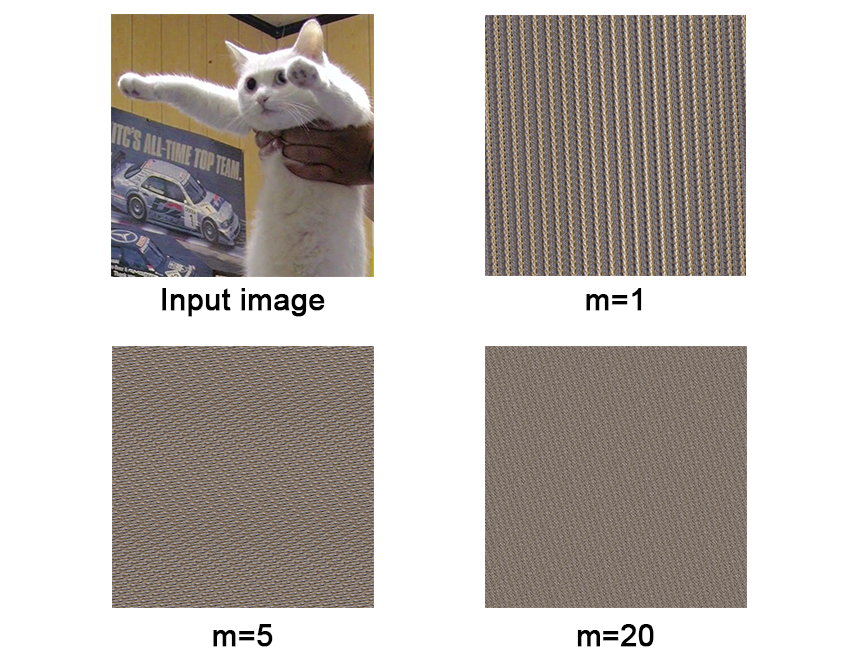
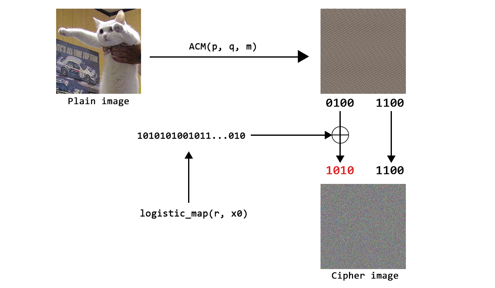

# Introduction

This is a series where I will try to reviewing and cryptanalyzing various cryptosystem schemes that proposed in academic journal, paper, and article from Universities in Indonesia.

As written in the title, this article tries to emphasize the sentence "Don't roll your own Crypto", where we can't just design or create our own cryptosystem algorithm. We should always use standarized algorithm for Cryptography. 

There's absolutely no intention or whatsoever about humiliating the research that discussed here. In fact, this is how the process of proposing a cryptosystem scheme is carried out, where some party proposes an idea, and the other parties will try to find the weaknesses of that idea, until finally from these weaknesses, it can be developed into a better scheme and so on. 

# Chaos-based Image Encryption

Cryptosystem that will be discussed in this first series is the study from article entitled **"ANALISIS KEAMANAN ALGORITMA ENKRIPSI CITRA DIGITAL MENGGUNAKAN KOMBINASI DUA CHAOS MAP DAN PENERAPAN TEKNIK SELEKTIF"** written by Rinaldi Munir, that published on Jurnal Ilmiah Teknologi Informasi (JUTI) in 2012 <sup>[[1]](#references)</sup>.

The article discussed about image encryption by using two Chaos-based function, which is **Arnold's Cat Map** as permutation and **Logistic Map** as keystream generator.

In addition, the article also explained the use of "selective encryption" where the encryption only done on the first 4-bit (Most Significant Byte), while the last 4-bit (Least Significant Byte) of the image (after permutation) never change.

## Arnold's Cat Map

Arnold's Cat Map is Chaos Map function that shuffle pixels position (in `(x,y)` coordinate) of the image.

The equation that used in the article is as follows.

$$
    \begin{bmatrix}
    x' \\
    y' \\
    \end{bmatrix}
    =
    \begin{bmatrix}
    1 & p \\
    q & pq + 1 \\
    \end{bmatrix}
    \begin{bmatrix}
    x \\
    y \\
    \end{bmatrix}
    \mod N
$$

Where `(x,y)` is the inital position and `(x', y')` is the position after permutation. Meanwhile, `N` is the size of the image and this function will be iterated `m` times.

So, the secret variables in this ACM function consists of `p`, `q`, and `m`.

The following is the visualization of the image after ACM has been performed several times. It can be seen that the higher the `m` value, the more random-looking the result will be.



To inverse this process, just multiply `(x', y')` with the inverse matrix of $ \begin{bmatrix} 1 & p\\ q & pq+1\\ \end{bmatrix} $.

## Logistic Map

Logistic Map is Chaos Map function from simple non-linear equation below.

$$
x_{i+1} = r x_i \left(1 - x_i\right)
$$

Where defined constant `r` as real number in the interval of 0 to 4 and `x0` as random initial value in the interval of 0 to 1. These variables are kept secret.

To generate keystream with Logistic Map, calculate the above equation which will be resulting `x1, x2, x3, ...` until the required length of keystream is met. Each value of `x1, x2, x3, ...` then will be represented as 4-bit key which is determined from the numbers after decimal point.

For example, given a sequence of Logistic Map that is `0.5, 0.875, 0.3828125, 0.8269348, ...`, then we take the number after decimal point (with pre-defined precision, 4 in this case) so they become `5, 875, 3828, 8269, ...`. Change each of the number to binary and take the last 4-bit (LSB) resulting keystream as follows: `0101, 1011, 0100, 1101, ...`

## Encryption

The encryption stages are as follows:



1. Define Plain-image `P`, secret key `p`, `q`, `m`, `r`, and `x0`.
2. Permutate image `P` using Arnold's Cat Map with `p`, `q`, and `m` as parameters, resulting image `Px`.
3. Generate keystream `K` using Logistic Map with constant `r` and inital value `x0`.
4. Encrypt 4-bit MSB each pixel of image `Px` with keystream `K` using XOR operation, resulting 4-bit `Cx` on each pixel.
5. Combine 4-bit `Cx` with 4-bit LSB of image `Px` on each pixel, resulting Cipher-image `C`


Implementation of this algorithm can be accessed in <a href="https://github.com/Merricx/chaos-image-encryption/blob/main/encryption.py" target="_blank">this link</a>.

# Cryptanalysis

Let's just try to do the cryptanalysis against this encryption scheme.

While conducting cryptanalysis, will be assumed some implementation scenario because the article didn't define a specification of how the implementation should be done.

Cryptanalysis model which we will use is **Chosen-Plain image Attack**, where we can encrypt any image as much as we want and receive the coresponding cipher image.

## Static Secret Key

Let's assume the implementation where secret key that consist of `p`, `q`, `m`, `r`, and `x0` are static and does not change in different encryption request.

### Recovery of Keystream

Because the value of `r` and `x0` always same, the result keystream generated from Logistic Map will also be same.

That means, we can determine keystream `K` easily as long as we know cipher image `C` and the coresponding plain image that has been permutated by ACM (`Px`) because:

$$
C = Px \oplus K \\
K = C \oplus Px
$$

But, here we still don't know the value of `Px` (only 4-bit LSB that we know) because we don't know value of `p`, `q`, and `m` of ACM.

Well, because this is Chosen-Plain image Attack and we can encrypt any image, we can just use plain image where all of the pixels are same such as full-black image or full-white image.

Because all of the pixels are same, the permutation from ACM will resulting same image too, so that we know `Px` and we can just find the keystream with XOR ¯\\\_(ツ)\_/¯

After we got the keystream, let's find `p`, `q`, and `m`.

### Recovery of `m`

It should be noted that ACM process is actually quite costly in terms of hardware, where in one ACM iteration (`m = 1`) takes quite long time to finish, so the time difference in the value of `m` and `m+1` is quite noticable.

This is actually dangerous because we can find out the value of `m` from **Timing Attack**. The higher the `m` value is, the longer the ACM operation will take.

The following is table of test results for the time required for the ACM process using `m = 1` to `m = 5` on a 1024x1024 image using my own laptop.

| m  | Time (s)      |
|----|---------------|
| 1  | 7.1236        |
| 2  | 13.8878       |
| 3  | 21.7516       |
| 4  | 27.8001       |
| 5  | 35.2292       |

It can be seen on the table that time required for the ACM is relatively consistent on the multiple of 7 seconds. From this time result, we can find `m` only from the time it takes to encrypt an image.

Actually from the start, keeping `m` secret is irrelevant, because after all, it is impossible that the value `m` would be too high, since it can bring performance issue if the value of `m` is too high. So, we can also just brute-force `m`.

### Recovery of `p` and `q`

After getting the value of `m`, finding `p` and `q` is trivial.

The idea is that we will create plain image where all of the pixels contain value of black color (0), except for one pixel that will be white colored (255) or value other than 0.

For example, we specify the white pixel on `(1, 0)`, then plain image with 4x4 size can be represented as the following matrix.

$$
\begin{pmatrix}
0 & 255 & 0 & 0 \\
0 & 0 & 0 & 0 \\
0 & 0 & 0 & 0 \\
0 & 0 & 0 & 0 \\
\end{pmatrix}
$$

Enter the plain image into encryption oracle, get the corresponding cipher image, then decrypt it using keystream that we got before, so we have permutated plain-image.

Lets assume the permutated plain image is as follows.

$$
\begin{pmatrix}
0 & 0 & 0 & 0 \\
0 & 0 & 0 & 0 \\
0 & 0 & 0 & 0 \\
0 & 0 & 255 & 0 \\
\end{pmatrix}
$$

Then, we can conclude that our previous pixel on `(1, 0)` move to `(2, 3)`.

Lets assume `m = 3`, then the equation of ACM will be as follows.

$$
    \begin{bmatrix}
    2 \\
    3 \\
    \end{bmatrix}
    =
    \begin{bmatrix}
    1 & p \\
    q & pq + 1 \\
    \end{bmatrix}^3
    \begin{bmatrix}
    1 \\
    0 \\
    \end{bmatrix}
    \mod N
$$

It can be rewritten to:

$$
\begin{equation}
\begin{aligned}
2 &\equiv \left( \left( p \cdot q + 1 \right) \cdot p + p \right) \cdot q + p \cdot q + 1 \pmod{N} \\ 
3 &\equiv \left( \left( p \cdot q + 1 \right)^2 + p \cdot q \right) \cdot q + \left( p \cdot q + 1 \right) \cdot q + q \pmod{N}
\end{aligned}
\end{equation}
$$

Where `p` and `q` can be found by solving linear equations in two variables (with modulus `N`).

Finally, with the knowledge of keystream `K`, secret value `p`, `q`, and `m`, we can decrypt any image that was encrypted under this secret key :).

### Proof of Concept

Lets prove it by implementing it into Python.

First, we define `encryption_oracle()` function which will be acting as a "server" where we can encrypt any image to that "server" and receive the corresponding cipher image.

```python
import random, os
import numpy as np
import encryption
from PIL import Image
from Crypto.Util.strxor import strxor

# Secret
p = random.randint(2,250)
q = random.randint(2,250)
m = 3
init = random.random()
r = 3 + random.random()

def encryption_oracle(plain_image):

    return encryption.encrypt(plain_image, p, q, m, init, r)
```

Then, write function to find keystream from chosen-plain image attack.

```python
def recover_keystream(size):

    # Generate full-black image
    plain_image = Image.new("RGB", (size, size))

    # Send image to encryption oracle
    cipher_image = encryption_oracle(plain_image)

    # Convert plain_image and cipher_image to bytes
    plain_image_bytes = bytes(np.array(plain_image).flatten().tolist())
    cipher_image_bytes = bytes(np.array(cipher_image).flatten().tolist())

    # Recover 8-bit keystream
    k = list(strxor(plain_image_bytes, cipher_image_bytes))

    # Get 4-bit MSB keystream
    keystream = []
    for i in range(size**2):
        bit_len = int(k[i]).bit_length()
        if bit_len > 4:
            msb = k[i] >> 4 & (2**(bit_len-4) - 1)
        else:
            msb = 0
        
        keystream.append(msb)
    

    return keystream
```

Then, write function to find `m` through Timing Attack.

```python
def recover_m():
    # avg. second of one encryption execution time (depends on the machine)
    one_exec_time = 10 

    start_time = time.time()
    payload = Image.new("RGB", (1024, 1024))

    encryption_oracle(payload)

    end_time = time.time()
    elapsed_time = end_time - start_time
    m = int(elapsed_time // one_exec_time)

    # Result could be faster or slower
    possible_m = [m, m-1, m+1]

    return possible_m
```

Lastly, to find `p` and `q`, we will use **Sagemath** with the `solve_mod()` function to solving linear equations in two variables as we discussed earlier.

```python
#!/usr/bin/env sage
def recover_pq(m, x0, y0, x1, y1, N):

    var('p,q')
    xy = matrix(2,1,[x0,y0])
    A = matrix([[1,p],[q, p*q + 1]])

    pos_result = solve_mod([
        (A^m * xy)[0][0] == x1,
        (A^m * xy)[1][0] == y1
        ], N)

    return pos_result

if __name__ == "__main__":

    m = 7 # ACM iteration
    x0 = 1
    y0 = 0
    x1 = 489 # x-coordinate after permutation
    y2 = 396 # y-coordinate after permutation
    N = 512 # image size

    print("Possible p,q: ")
    print(recover_pq(m, x0, y0, x1, y2, N))
```

Full implementation of this attack can be found in [this link](https://github.com/Merricx/chaos-image-encryption).

## Static Secret Key with Dynamic `x0`

The next implementation scenario is assumed that the variable `p`,`q`,`m`,`r` is static but the variable `x0` is dynamic, where this value will change randomly in different encryption request.

This is the most ideal scenario that can possibly implemented in this scheme, because static keystream is no longer happened.

However, the problem is how this `x0` can be associated in each of different images. One possible approach is to treat `x0` as Initialization Vector (IV) as we seen in block cipher. But, this value must still be encrypted again with certain method and listed in every image that has been encrypted using that value.

Let's ignore the technical side of how `x0` implemented. Our assumption in this scenario is that for every request to the encryption oracle, the value of `x0` will be arbitrary and random.

Because repeated keystream can no longer be exploited, it will be difficult for us to finding the keystream from chosen-plain image attack, since this encryption basically becomes **One-Time Pad**. 

### Recover ACM secret

Then how can we find `p` and `q` without knowing the *keystream* that currently used? 

This is where the security flaw from the use of **"selective encryption"** occurs, where cipher image leaks information from the LSB of the plain image. 

Lets assume we use plain image that represented as follows:

$$
\begin{pmatrix}
0 & 255 & 0 & 0 \\
0 & 0 & 0 & 0 \\
0 & 0 & 0 & 0 \\
0 & 0 & 0 & 0 \\
\end{pmatrix}
$$

Enter the plain image into encryption oracle. Then, suppose we get cipher image as follows.

$$
\begin{pmatrix}
32 & 96 & 176 & 32 \\
112 & 240 & 112 & 144 \\
32 & 95 & 192 & 80 \\
176 & 208 & 48 & 160 \\
\end{pmatrix}
$$

Lets change each of the pixel to binary representation and boom!! *LSB oracle goes brrrr!*

$$
\begin{pmatrix}
00100000 & 01100000 & 10110000 & 00100000 \\
01110000 & 11110000 & 01110000 & 10010000 \\
00100000 & 01011111 & 11000000 & 01010000 \\
10110000 & 11010000 & 00110000 & 10100000 \\
\end{pmatrix}
$$

Because of this selective encryption scheme, we still know the position of our white pixel after the permutation because 4-bit LSB of the plain image never changes (just looks 4-bit LSB that doesn't have the value `0000`). 

Just continue using the same method as the previous scenario by solving the linear equations of two variables to find `p` and `q` (value of `m` can still be found through Timing Attack). 

Next, how can we find dynamic *keystream* value? Meanwhile One-Time Pad is an "unbreakable cipher". 

### Weak Logistic Map

The only thing we can try to exploit is from the implementation of Logistic Map. 

Analysis of how Logistic Map works is beautifully explained in <u>geoffboeing.com</u> <sup>[[2]](#references)</sup>. Interestingly, there are several things that can make the generation results of Logistic Map repetitive and periodic if the constant `r` and the initial value `x0` are not picked carefully. 

Let's try to do a little experiment using the implemented Logistic Map based on this article in generating keystream. 

```python
import random
import encryption

for i in range(1000):
    init = random.random()
    r = random.randint(0,3) + random.random()
    print('x0:', init)
    print('r :', r)
    print('keystream', encryption.logistic_map(init, r, 100, 10))
    print()
```

Running the script and take some interesting result.

```
x0: 0.7244972999777215
r : 2.2929146462509595
keystream: [7, 2, 15, 3, 5, 14, 0, 9, 1, 15, 7, 10, 0, 11, 10, 14, 6, 4, 5, 5, 5, 5, 5, 5, 5, 5, 5, 5, 5, 5, 5, 5, 5, 5, 5, 5, 5, 5, 5, 5, 5, 5, 5, 5, 5, 5, 5, 5, 5, 5, 5, 5, 5, 5, 5, 5, 5, 5, 5, 5, 5, 5, 5, 5, 5, 5, 5, 5, 5, 5, 5, 5, 5, 5, 5, 5, 5, 5, 5, 5, 5, 5, 5, 5, 5, 5, 5, 5, 5, 5, 5, 5, 5, 5, 5, 5, 5, 5, 5, 5]

x0: 0.18893176526337663
r : 1.6653541535673568
keystream: [4, 9, 3, 1, 9, 7, 10, 8, 15, 15, 11, 7, 2, 15, 6, 12, 0, 8, 5, 15, 8, 11, 12, 12, 12, 12, 12, 12, 12, 12, 12, 12, 12, 12, 12, 12, 12, 12, 12, 12, 12, 12, 12, 12, 12, 12, 12, 12, 12, 12, 12, 12, 12, 12, 12, 12, 12, 12, 12, 12, 12, 12, 12, 12, 12, 12, 12, 12, 12, 12, 12, 12, 12, 12, 12, 12, 12, 12, 12, 12, 12, 12, 12, 12, 12, 12, 12, 12, 12, 12, 12, 12, 12, 12, 12, 12, 12, 12, 12, 12]

x0: 0.8927173285063715
r : 3.5157732279084075
keystream: [5, 13, 12, 12, 14, 5, 4, 0, 8, 0, 5, 8, 10, 0, 2, 11, 9, 0, 9, 7, 15, 2, 5, 14, 1, 2, 10, 15, 14, 11, 9, 15, 0, 9, 15, 7, 7, 13, 15, 1, 3, 11, 0, 2, 2, 1, 0, 15, 13, 2, 6, 15, 4, 8, 4, 12, 0, 2, 12, 1, 5, 6, 6, 12, 8, 0, 10, 5, 8, 15, 4, 10, 0, 4, 1, 4, 9, 1, 2, 0, 6, 8, 2, 1, 7, 5, 2, 1, 6, 6, 2, 1, 7, 6, 2, 1, 6, 6, 2, 1, 7, 6, 2, 1, 6, 6, 2, 1, 6, 6, 2, 1, 6, 6, 2, 1, 6, 6, 2, 1, 6, 6, 2, 1, 6, 6, 2, 1, 6, 6, 2, 1, 6, 6, 2, 1, 6, 6, 2, 1, 6, 6, 2, 1, 6, 6, 2, 1, 6, 6, 2, 1]
```

As we can see from the generated keystream above, the Logistic Map produces sequence that is truly repetitive both statically and periodically.

Based from the experiment, we can note some value in the constant `r` that will potentially cause repetitive keystream.

The list of constants `r` that potentially generate a static *keystream* is: 
```
1.1 ~ 2.4
2.6 ~ 2.8
3.3
```

Whereas, The list of constants `r` that potentially generate periodic *keystream* is: 
```
2.5
2.9
3.1
3.2
3.4
3.5
```

From the two phenomena above, it can be concluded that the key space in choosing the constant `r` is increasingly limited to avoid repeated keystream, both statically and periodically. 

So, the constant `r` that might be chosen to avoid repetition is to choose one of the following values. 
```
1.0~
3.0~
3.6~
3.7~
3.8~
3.9~
```

> For the values of 0.9 and below are ignored because after several generation process, the sequence will tend to 0 values, so it can't generate large keystream.

So, to get dynamic keystream from the Logistic Map, first we check whether there are repetition in the pixels of the cipher image (especially at the bottom pixels). For static repetition, we simply brute-force 1 out of 16 possible values, while for periodic repetition, we simply brute-force 2 to 4 out of 16 possible values. 

If there is no sign of repetition of the keystream bit, we can brute-force to find the value of the constant `r` from a list of possible values that will not cause repetition previously along with the initial value of `x0`. 

### Proof of Concept

Implementation of this attack can be accessed in [this link](https://github.com/Merricx/chaos-image-encryption)

# Conclusion

From the two implementation scenarios that discussed above, it can be concluded that this Chaos-based Image Encryption is truly vulnerable to Chosen-Plain image Attack (Known-Plain image Attack can also viable in some conditions). 

Both the Arnold's Cat Map, Logistic Map, as well as the use of the selective encryption are vulnerable that can make *attacker* decrypt any encrypted image without access to the secret key that is currently used. Lastly, further development needs to be studied to produce even better algorithm, especially in terms of security. 

# References

1. Munir, Rinaldi. (2012). ANALISIS KEAMANAN ALGORITMA ENKRIPSI CITRA DIGITAL MENGGUNAKAN KOMBINASI DUA CHAOS MAP DAN PENERAPAN TEKNIK SELEKTIF. JUTI: Jurnal Ilmiah Teknologi Informasi. 10. 89. 10.12962/j24068535.v10i2.a310.  
2. https://geoffboeing.com/2015/03/chaos-theory-logistic-map/