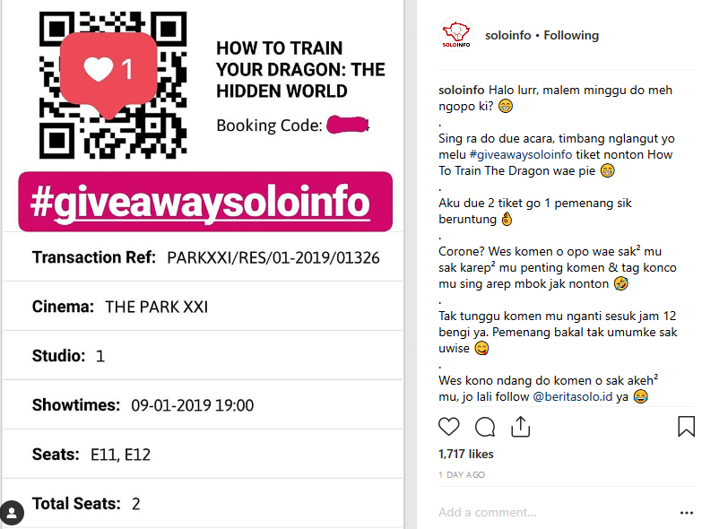
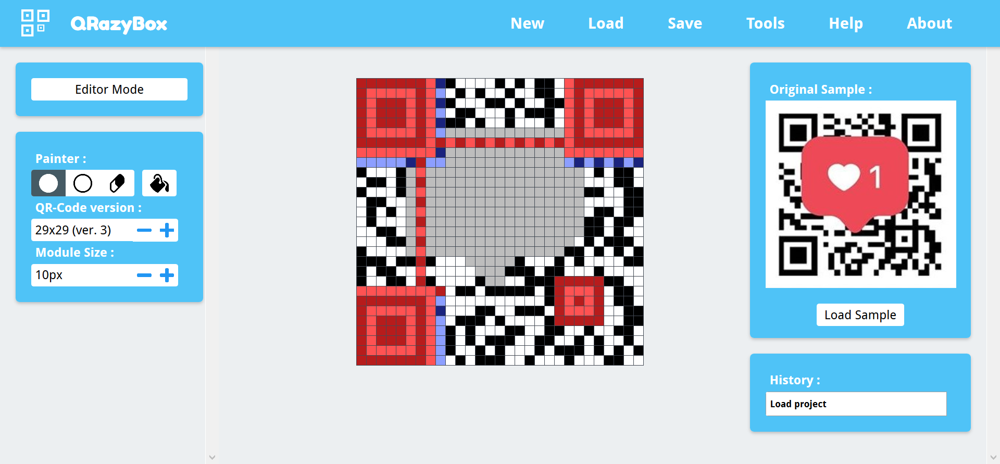
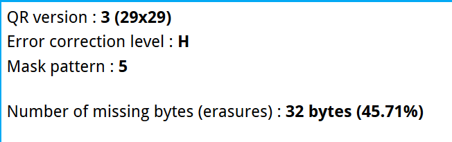
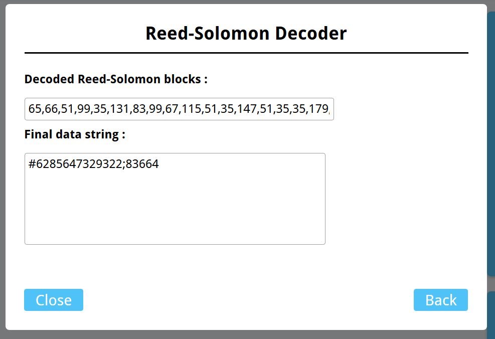
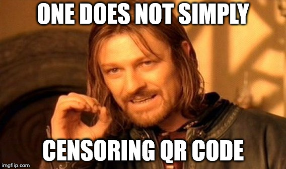

Beberapa hari yang lalu, ketika saya sedang browsing di Instagram tiba-tiba saya menemukan sesuatu yang cukup menarik perhatian saya.

Saya menemukan sebuah post dari akun **@soloinfo** yang berisi sebuah Giveaway tiket nonton gratis **How to Train your Dragon 3** untuk 2 orang. Giveaway itu sendiri cukup simple dan sama seperti giveaway pada umumnya. Pengguna saling mengomentari dengan men-tag beberapa temannya, lalu pemenangnya akan diundi diantara komentar-komentar tersebut.

Berikut adalah gambar pada postingan tersebut.

# How to ~~Train your Dragon~~ Pwn Someone Tickets

Saya sih tidak terlalu tertarik pada giveaway-nya, lagian saya juga nggak bakal pernah menang giveaway :'D.
Namun yang menarik perhatian saya adalah QR code yang tersensor di beberapa bagiannya tersebut.

Karena perasaan saya nggak enak ketika melihat QR code tersebut, langsung saya coba import gambar tersebut ke [QRazyBox](https://merricx.github.io/qrazybox/). Edit beberapa bagian yang tertutup dengan rekonstruksi manual.

Lihat spesifikasi pada QR code tersebut.

Dan ternyata QR tersebut menggunakan **Error Correction Level High**, dimana selama masih ada sekitar **30%** bagian yang tidak rusak, kita masih dapat melakukan rekonstruksi ulang menggunakan *Reed-Solomon*. Disini dapat diambil kesimpulan juga bahwa semua QR code pada sistem M-Tix kemungkinan juga menggunakan Error Correction level yang sama.

Sebagai gambaran, QR code yang rusak seperti gambar dibawah masih dapat dibaca sepenuhnya ketika menggunakan Error Correction Level H.

<figcaption class="caption">I'm still readable bitch! (Heavy-breathing...)</figcaption>

Jika QR code dengan kerusakan seperti itu saja masih bisa ter-*recover*, apalagi dengan QR code pada postingan tersebut dimana kerusakannya hanya sekitar 40%.

Tanpa berlama-lama langsung saya gunakan fitur *Reed-Solomon Decoder* dan didapatkan pesan QR code yang sesungguhnya.

Dimana **6285647329322** adalah nomor telepon pemesan dan **83664** adalah *booking code* pada tiket tersebut. Langsung masukkan nomor telepon beserta kode booking tersebut ke mesin M-Tix di Bioskop dan *voila!*, saya dapat tiket nonton gratis buat berdua :).

# Moral of Story

Jadi, apa yang bisa kita ambil dari cerita sangat singkat ini? ._.

### Sebagai Netizen

Kita sebaiknya berhenti men-*share* segala sesuatu dimana terdapat QR code dengan informasi sensitif didalamnya ke media sosial ataupun internet seperti halnya tiket tersebut.

Ditambah, di zaman sekarang hampir semua tiket, struk, ataupun alat transaksi lainnya menggunakan QR code sebagai media dalam memvalidasi transaksi tersebut karena selain simple, juga kelebihan QR code pada kecepatan *data reading*-nya dan fleksibilitas data yang disimpan.

Jikapun terpaksa harus menampilkan QR code tersebut, sebaiknya **semua bagian** pada QR code benar-benar tertutup.

### Sebagai Developer

Sebagai developer yang mengembangkan sistem yang melibatkan QR code, kita harus lebih bisa memilih *Error Correction Level* yang tepat.

**Error Correction Level H** pada QR code dalam bentuk digital seperti tiket online seperti ini saya rasa kurang tepat, karena **Level H** ditujukan untuk QR code yang akan didistribusikan di lingkungan yang berpotensi merusak QR code tersebut (contohnya QR code dalam bentuk fisik/kertas yang ditempel di sekitar tempat umum).

*Best practice*-nya menurut saya sih, cukup gunakan **Level M** untuk QR code bentuk digital dan **Level Q** untuk QR code bentuk fisik.

---

Sebelumnya ada kasus serupa juga di Prancis yang melibatkan QR code berisi *Private Key* sebuah Bitcoin wallet, dimana sang pemilik Bitcoin secara tidak sengaja menampilkan sedikit bagian dari QR code tersebut yang telah disensor sebelumnya. Akhirnya, *Private key* pada QR code tersebut dapat diambil dengan me-*recover* QR code tersebut.

Artikel lengkapnya dapat dilihat di tautan ini: <https://medium.freecodecamp.org/lets-enhance-how-we-found-rogerkver-s-1000-wallet-obfuscated-private-key-8514e74a5433>.

*Anyway*, saya telah menghubungi admin dari **@soloinfo** terkait hal ini dan karena saya berniat untuk tidak meng-*claim* tiket tersebut, maka giveaway-nya pun tetap dilanjutkan sebagaimana semestinya.