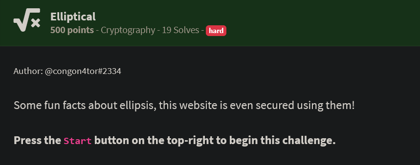
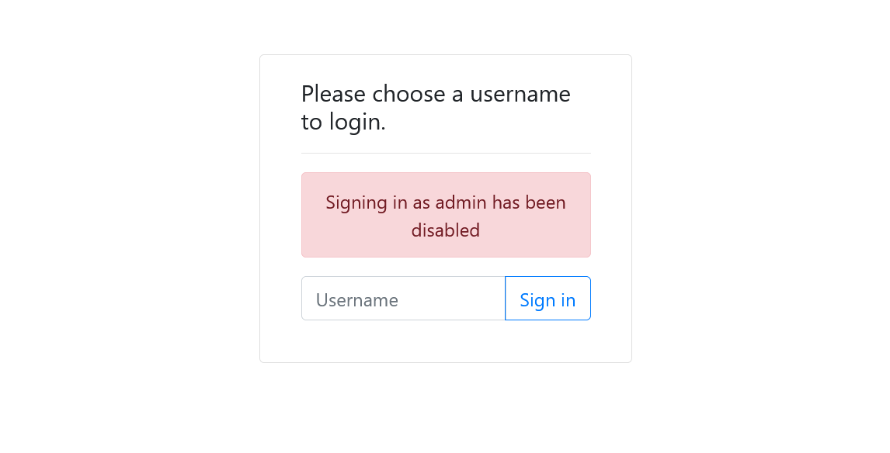
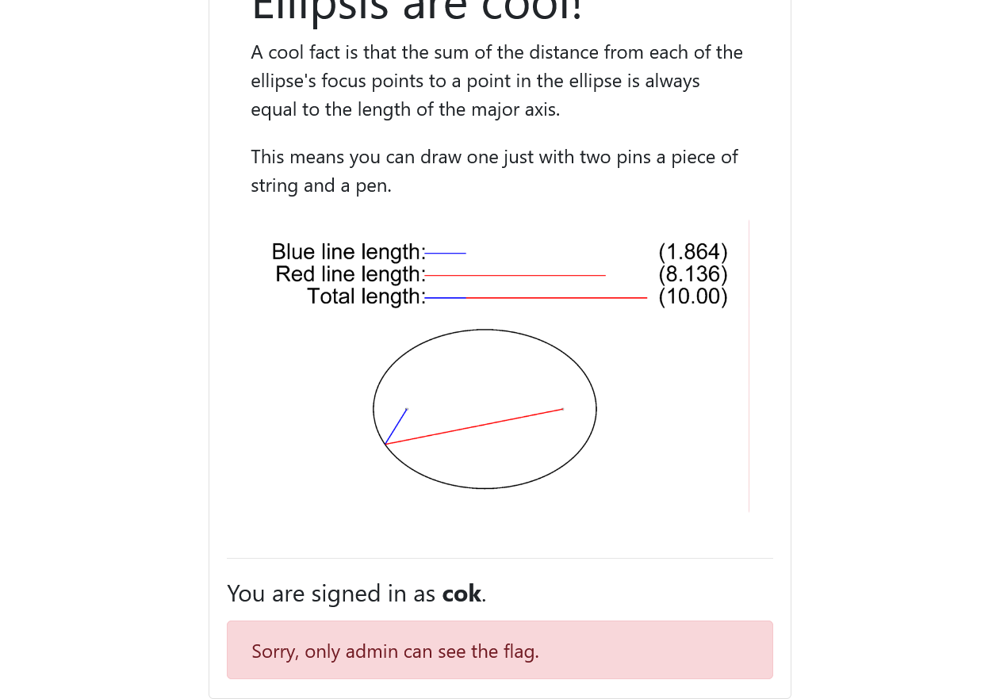
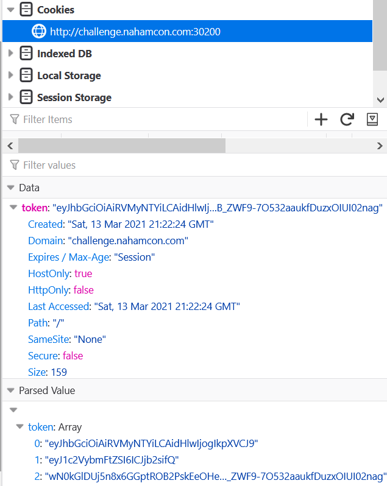
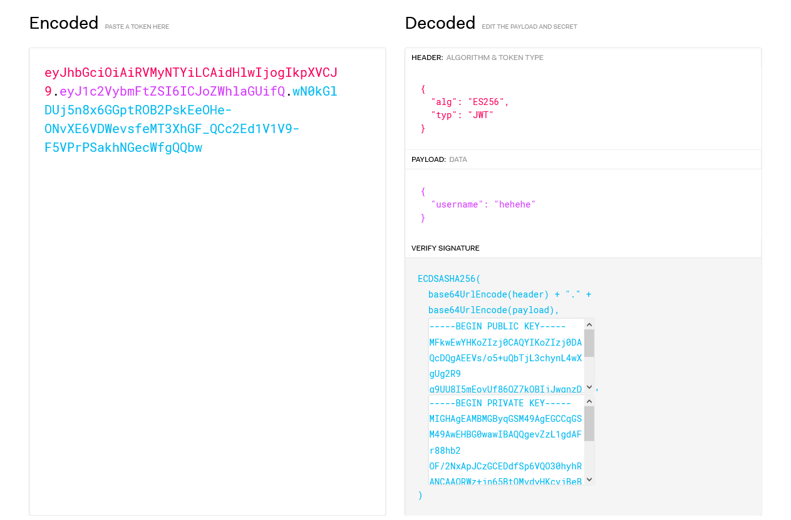
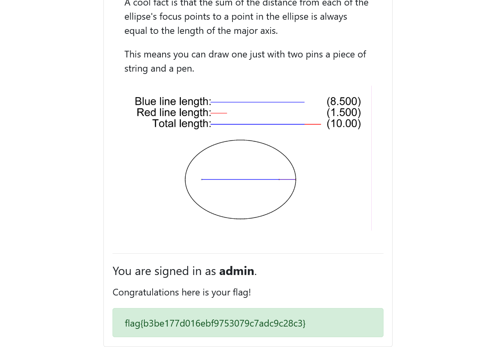

# Challenge

Given website where user can sign in with any username, except with username `admin`.



After signed in, website will show simple static text and image that shown below and the bottom text that says "Sorry, only admin can see the flag".



Based on that observation, we can conclude that in this challenge, we must change our username to `admin` by exploiting "some crypto magic".

So, what is the indicator that used by website so that it knows who is currently accessing the page?

# JWT

Of course, the most common mechanism to store information about the user that currently accessing a website is called **cookie**.  
In this challenge, cookie is used in the form of JSON Web Token (JWT) to store the information about current user.



Basically, JSON Web Token consists of 3 main parts, which is **header**, **payload**, and **signature**.



**header** contains the information about algorithm that is used to sign and build **signature** part. 

**payload** contains main information about the user that currently accessing the web.

And then, **signature** is the hash result of **header** and **payload** (Base64-encoded and concatenated by dot) using algorithm that defined by **alg** in **header** part.

This **signature** then is used as verification whether data on **header** or **payload** has been modified or not. If data on **header** or **payload** has been modified or forged, then the result of **signature** will not be the same, thus the token will be considered invalid.

Every part of JWT will be encoded with Base64Url and separated with dot sign (**.**).

In this challenge, the hash algorithm use **ES256** or **ECDSA-SHA256**. On the **payload** part, it only contains `username` of the current user.


# Vulnerability Analysis

If we pay attention to the signing process in this web, there's an oddity on the resulting **signature** after we signed in multiple times, as shown below.

```
Username: admin1
wN0kGlDUj5n8x6GGptROB2PskEeOHe-ONvXE6VDWevsS2fyKPc817Sox60QP-jgXhlM0kVkjKFhk-VUgMSOYjg


Username: some random username
wN0kGlDUj5n8x6GGptROB2PskEeOHe-ONvXE6VDWevuVkYXwniERimgSFQ2cea0-BUwYCLQ60reeuAIyROAxkw


Username: hehehe
wN0kGlDUj5n8x6GGptROB2PskEeOHe-ONvXE6VDWevsfeMT3XhGF_QCc2Ed1V1V9-F5VPrPSakhNGecWfgQQbw
```

Yupp, there's big repeating signature result even with completely different username.

A secure hash algorithm when there's little input difference, even only 1 byte, it should produce a completely different hash result. But in this web, the first 64 byte on the resulting signature never change.

Other than that, if we repeat the signing process with same username, the resulting signature also never change.

Whereas, algorithm in ES256 or ECDSA is asymmetric algorithm that even the same message should produce different signature because the random property in it.

So, we can conclude that there's something that should be random but it isn't :/

# ECDSA

We will briefly discuss how ECDSA algorithm signing a message.

ECDSA (*Elliptic-Curve Digital Signature Algorithm*) is the variant of DSA (Digital Signature Algorithm) which uses Elliptic-Curve as its signature calculation.

In the Elliptic-Curve, there's some parameters that defined before doing any calculations. Here are the parameters used specifically in ES256.

```
G = (0x6b17d1f2e12c4247f8bce6e563a440f277037d812deb33a0f4a13945d898c296, 0x4fe342e2fe1a7f9b8ee7eb4a7c0f9e162bce33576b315ececbb6406837bf51f5)
n = 115792089210356248762697446949407573529996955224135760342422259061068512044369
d = random(1, n-1)
Q = d * G
```

where

```
G = Elliptic curve base point
n = integer order of G
d = private key
Q = public key
```

Suppose we want to sign message `m`, then we do the following steps:

- Calculate `e`, where `e = SHA256(m)`.
- Calculate `z` where `z = int(e, 16)`.
- Pick random integer `k` from interval `[1, n-1]`.
- Calculate the curve point `(x1, x2) = k * G`
- Calculate `r = x1 % n`. If `r = 0`, repeat the `k` selection.
- Calculate `s = (inverse_mod(k, n) * (z + (r * d) % n)) % n`. If `s = 0`, repeat the `k` selection.
- The valid signature is the pair `(r, s)`.

# Not so random k

As we have analyzed previously, there's possibility that the "random" on the ECDSA in this challenge is not random.

From the signing calculations that we have discussed above, only `k` that was picked randomly. Therefore, we can assume that in this website, there's Nonce reuse vulnerability, where integer `k` is static and used repeatedly on the different signing process.

Then, why the value of `k` that is not random can cause dangerous flaw on this website?

Given two valid signature `(r, s1)` and `(r, s2)` from the signing message `m1` and `m2` using the same `k`, attacker can trivially calculate `z1` and `z2`.

And because `s1 - s2 = inverse_mod(k, (z1 - z2))`, attacker can find `k` by calculate:

```
k = (z1 - z2) / (s1 - s2)
```

Then, attacker can easily find `d` with:

```
d = (s1 * k - z1) / r
```

# Proof of Concept

Let's implement the attack in Python to get the private key and generate valid JWT with username `admin`:

```python
from Crypto.Util.number import *
import requests, base64, hashlib
from fastecdsa import ecdsa
from fastecdsa.curve import P256

def auth(user):
    session = requests.Session()
    response = session.post(url='http://challenge.nahamcon.com:30200/signin', data={'username':user})

    token = session.cookies.get_dict()['token']
    hashed = token.split('.')[0] + '.' + token.split('.')[1]
    signature = token.split('.')[-1]

    raw_signature = base64.b64decode(signature.replace('-', '+').replace('_','/')  + "==").hex()

    return hashed.encode(), int(raw_signature[:64], 16), int(raw_signature[64:], 16)

def modinv(a, modulus):
    return pow(a, modulus - 2, modulus)

def divmod(a, b, modulus):
    return (a * modinv(b, modulus)) % modulus

m1, r, s1 = auth('admim')
m2, r, s2 = auth('admio')

order = P256.q
z1 = int(hashlib.sha256(m1).hexdigest(), 16)
z2 = int(hashlib.sha256(m2).hexdigest(), 16)

k = divmod(z1 - z2, s1 - s2, order)
d = divmod(k * s1 - z1, r, order)
print("[+] Private key:", d)

new_token = b'eyJhbGciOiAiRVMyNTYiLCAidHlwIjogIkpXVCJ9.' + base64.b64encode(b'{"username":"admin"}')
r, s = ecdsa.sign(new_token, d)
print("[+] Forged signature:", (r, s))
new_token += b"." + base64.b64encode(long_to_bytes(r) + long_to_bytes(s)).replace(b'+',b'-').replace(b'/',b'_').replace(b'=',b'')

print("[+] JWT:", new_token.decode())
```

Run the script and we got the valid JWT.

```bash
~$ python solve_elliptic.py
[+] Private key: 76360441104529975103479885636071599682318869381694694853301440181334888705951
[+] Forged signature: (66378196147239170843827166360250592759597163597715304772573917957470106804741, 106147551365476994967159598162752611693743616349309630180573719192813726918650)
[+] JWT: eyJhbGciOiAiRVMyNTYiLCAidHlwIjogIkpXVCJ9.eyJ1c2VybmFtZSI6ImFkbWluIn0=.ksC6RjVxDXfXips96dGXrpC0DoB87qpDSrBrBgn14gXqrWKQDWejXdEUJmwIoIVIcIrt8IuDGIRzZbPzbIjn-g
```

Insert the resulting JWT as a cookie and we got the flag :D

