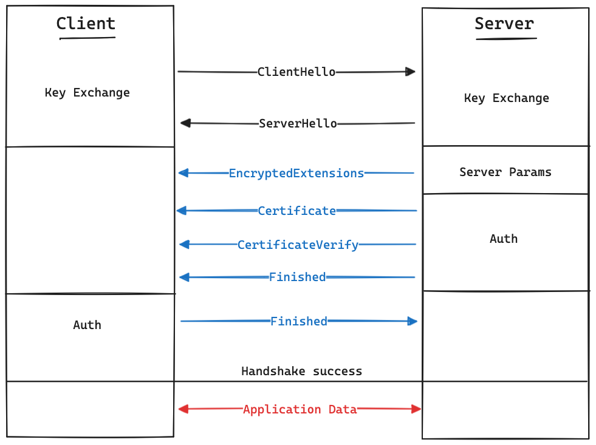
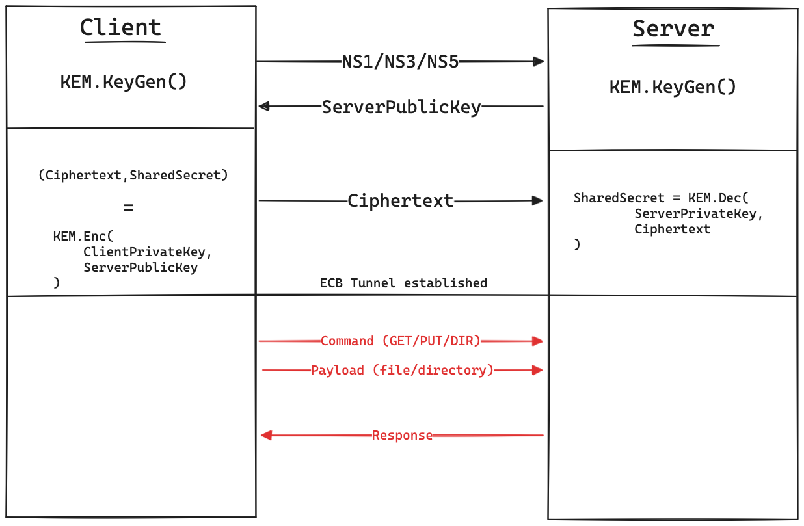
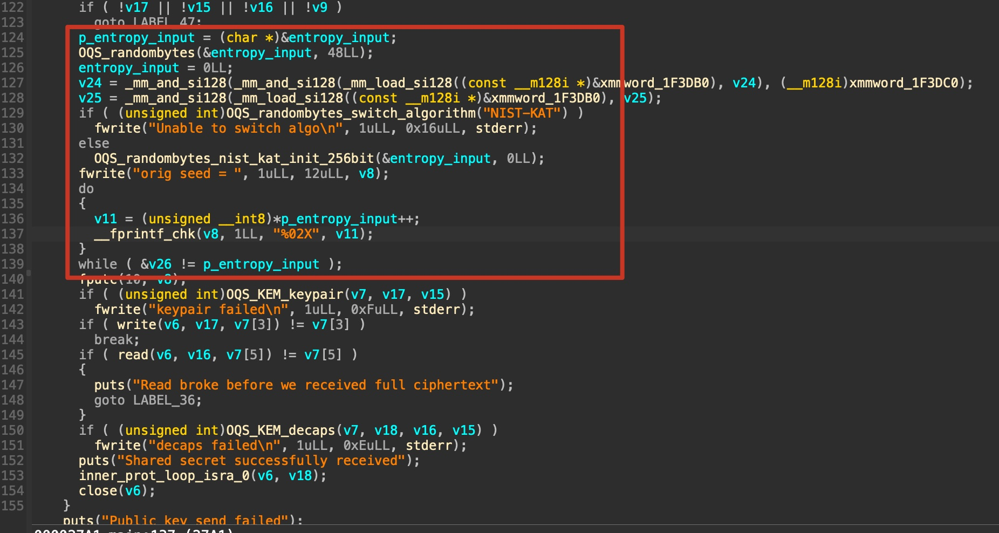
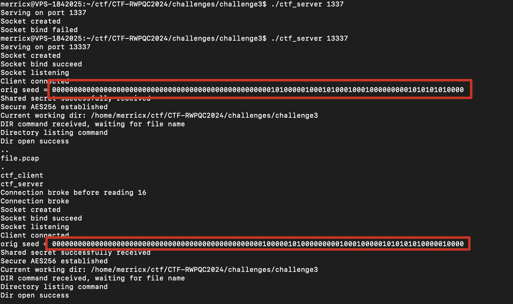
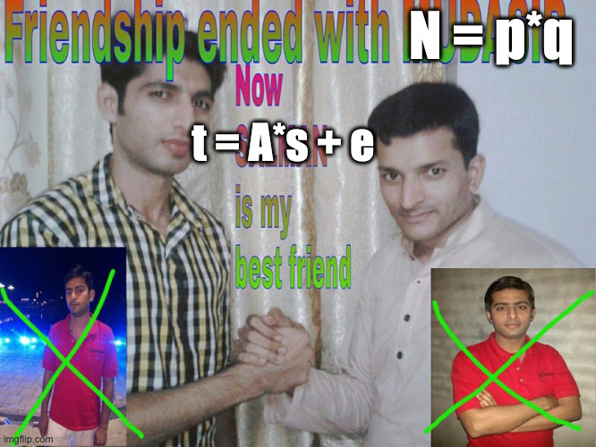

In this early March, there is a small individual CTF competition organized by [SandboxAQ](https://www.sandboxaq.com/) as part of annual RWPQC (Real World Post-Quantum Cryptography) workshop event which is also co-located as part of RWC 2024 (Real World Cryptography) event.

I casually participated in this CTF and ended up in 5th position. Although, I don't really care about the rank since I'm not eligible for the prize anyway and I just want to think this as an excuse to learn about PQC, especially in the protocol level.

The full challenges can be accessed from [this Github repository](https://github.com/sandbox-quantum/CTF-RWPQC2024), where unlike regular CTF, participant must send the solution (flag) to the SandboxAQ email.

There are four challenges in total. They are mostly related to [**Kyber**](https://pq-crystals.org/kyber/), one of standardized post-quantum cryptography which is now formally called as **ML-KEM**. 


# TL;DR

Because the technical explanation of all challenges combined become quite long, I wrote small TL;DR on how each challenge was solved. Please refer to the respective sub section of each challenge for detailed explanation.

- [**Challenge 4**: Dancing by Xyber](#challenge-4) - Fix incorrect implementation of *x25519kyber768draft00* to achieve TLS 1.3 handshake
- [**Challenge 3**: Breaking a real PQC implementation. How to be a crypto analyst](#challenge-3) - Server implemented Kyber with deterministic PRNG (*AES256_CTR_DRBG*) but with very low entropy seed (24 bits) which is easily reconstructed to derive shared secret
- [**Challenge 1**: Degrees of polynomials in post-quantum cryptography. Breaking baby Kyber](#challenge-1) - Small Kyber parameter which is solvable via lattice reduction to recover private key
- [**Challenge 2**: Attack on Trained Logistic Regression Model](#challenge-2) - Training data reconstruction in GLM by solving linear equation due to intercept parameter, as proposed by Balle *et al*.

> Note that the order of challenge solution written here is based from the order of solve (which in my opinion also align with the order of difficulty, from easiest to hardest)

# Challenge 4

We are given python module called `tlslite` which contain pure-python implementation of TLS and remote socket server which act as TLS server. Compared to the original `tlslite`, this module also contains Kyber implementation from [kyber-py](https://github.com/GiacomoPope/kyber-py).

We are also provided with the following `client.py` file to connect to remote server.

```python
import socket
from tlslite.api import *

def main():

    address = ("35.196.160.7", 4433)

    sock = socket.socket(socket.AF_INET, socket.SOCK_STREAM)
    sock.settimeout(5)
    sock.connect(address)
    sock.setsockopt(socket.IPPROTO_TCP, socket.TCP_NODELAY, 1)
    connection = TLSConnection(sock)

    settings = HandshakeSettings()
    connection.handshakeClientCert(None, None,
        settings=settings)
    print("Handshake success")

    connection.send(b"GET /flag HTTP/1.1\r\nHost: localhost\r\nUserAgent: ctf-client\r\n\r\n")
    data = b""
    while True:
        try:
            r = connection.recv(1024)
            if not r:
                break
            data += r
        except socket.timeout:
            break
        except TLSAbruptCloseError:
            break
    print("Received data: ", data.decode())

if __name__ == '__main__':
    main()
```

In summary, the script want to perform TLS handshake against remote server and then send GET request to `/flag` endpoint. But, upon running the script, we got the following error:

```python
tlslite.errors.TLSRemoteAlert: illegal_parameter
```

### TLS Handshake

In order to solve this challenge, we need to understand the basic flow of TLS handshake, especially TLS 1.3 which the server was using. Complete specification of TLS 1.3 is defined in [RFC 8446](https://datatracker.ietf.org/doc/html/rfc8446).

In summary, this is the simplified flow of TLS 1.3 handshake:



> Blue line denotes encrypted traffic under handshake keys, while red line denotes encrypted traffic under application keys.

1. **`ClientHello`:** The client initiate the handshake by sending message containing supported cryptographic algorithms and other parameters to the server
2. **`ServerHello`:** The server responds by selecting compatible cryptographic parameters from the client's list and sending them back
3. **`EncryptedExtensions`:** The server sends protected extensions response that is requested from `ClientHello`.
4. **`Certificate`:** The server sends one or more digital certificate to prove server's identity
5. **`CertificateVerify`:** The server provides digital signature that prove certificate's ownership
7. **`Finished`:** Both parties send "Finished" messages to confirm the completion of the handshake. This messages contain MAC over the entire handshake as confirmation.

Back to our previous problem, the error was happened after `ClientHello` where server told us that <u>some parameters that we sent was wrong</u>. But, what are these parameters?

### Hybrid Key Exchange

At the time of writing, post-quantum cryptography is not "officially" standardized in TLS yet. But several RFC drafts already written and proposed to bring this to practical implementation. 

The approach is to use so-called "hybrid key exchange" which combines classical cryptography (RSA, DH, ECDH) with post-quantum cryptography with the goal of providing security even if all but one of the component algorithms is broken.

The algorithms that already drafted are:
- **X25519Kyber768Draft00** <sup id="fnref-1">[[1]](#fn-1)</sup> = X25519 + Kyber768
- **SecP256r1Kyber768Draft00** <sup id="fnref-2">[[2]](#fn-2)</sup> = SecP256r1 + Kyber768

According to *draft-ietf-tls-hybrid-design-09*<sup id="fnref-3">[[3]](#fn-3)</sup>, public key or ciphertext is represented as `KeyShareEntry` in the `extensions_data` fields. This `KeyShareEntry` will then contain `key_exchange` field which is the concatenation of the `key_exchange` field for each of the constituent algorithms.

If we check the `client.py` implementation and dive into the `HandshakeSettings` class, we can see the following default parameters:

```python
def _init_key_settings(self):
    """Create default variables for key-related settings."""
    self.minKeySize = 1023
    self.maxKeySize = 8193
    self.rsaSigHashes = list(RSA_SIGNATURE_HASHES)
    self.rsaSchemes = list(RSA_SCHEMES)
    self.dsaSigHashes = list(DSA_SIGNATURE_HASHES)
    self.virtual_hosts = []
    # DH key settings
    self.eccCurves = list(CURVE_NAMES)
    self.dhParams = None
    self.dhGroups = list(ALL_DH_GROUP_NAMES)
    self.defaultCurve = "secp256r1"
    self.keyShares = ["x25519", "x25519kyber768draft00"]
    self.padding_cb = None
    self.use_heartbeat_extension = True
    self.heartbeat_response_callback = None
```

Which we can conclude that in the `ClientHello` step, the client offer `keyShareEntry` to server of either `x25519` or `x25519kyber768draft00`. Presumably, the server responds back to choose `x25519kyber768draft00`.

If we are then looking at the `tlslite/keyexchange.py`, we will see the following oddity in `get_random_private_key` and `calc_public_value` function:

```python
def get_random_private_key(self):
    """Return random private key value for the selected curve."""
    ...
    elif self.group == GroupName.x25519kyber768draft00:
        return getRandomBytes(X25519_ORDER_SIZE)
    ...

def calc_public_value(self, private):
    """Calculate public value for given private key."""
    ...
    elif self.group == GroupName.x25519kyber768draft00:
        return x25519(private, bytearray(X25519_G))
    ...
```

Also in the `calc_shared_key` function:

```python
def calc_shared_key(self, private, peer_share):
    """Calculate the shared key,"""
    ...
    elif self.group == GroupName.x25519kyber768draft00:
        S = x25519(private, peer_share)
        self._non_zero_check(s)
        return S
    ...
```

Those three functions are just implementing normal `x25519` instead of `x25519kyber768draft00`! That's why the server reject the parameters.
So we need to fix these to correct implementation.

### X25519Kyber768Draft00

According to the specification of *X25519Kyber768Draft00* section 3, it defined that in the client share `key_exchange` value contains the concatenation of the X25519 ephemeral share (32 bytes) and the Kyber768 public key (1184 bytes).

After `key_exchange` received by the server, it will respond back as `key_exchange` to the client with ephemeral server public key of x25519 (32 bytes) and ciphertext of Kyber768 (1088 bytes). Then, shared secret can be calculated by concatenating shared secret of x25519 and Kyber768 into one.

Let $sk_c$ be client's x25519 ephemeral private key, $pk_s$ be x25519 ephemeral public key from server, $pqsk_c$ be client's Kyber768 ephemeral private key and $pqctxt_s$ be Kyber768 ciphertext, then shared secret $S$ calculated with:

$$
\begin{aligned}
S_1 & = \text{X25519}(sk_c, pk_s) \\
S_2 & = \text{KEM.DEC}(pqsk_c, pqctxt_s) \\
S & = S_1 || S_2
\end{aligned}
$$

> Note that in practice, Kyber is used as KEM (*Key Encapsulation Mechanism*), instead of PKE (*Public Key Encryption*).

### Solve Script

Since the module already contains Kyber implementation, we don't need to implement ourselves. We just need to edit small part of `tlslite/keyexchange.py` file to follow the *X25519Kyber768Draft00* specification.

Here is the final diff patch of `tlslite/keyexchange.py` file:

```diff
--- a/challenges/challenge4/tlslite/keyexchange.py
+++ b/challenges/challenge4/tlslite/keyexchange.py
@@ -999,7 +999,9 @@ class ECDHKeyExchange(RawDHKeyExchange):
             else:
                 return getRandomBytes(X448_ORDER_SIZE)
         elif self.group == GroupName.x25519kyber768draft00:
-            return getRandomBytes(X25519_ORDER_SIZE)
+            x25519_priv = getRandomBytes(X25519_ORDER_SIZE)
+            kyber_priv = Kyber768.keygen()[1]
+            return x25519_priv+kyber_priv
         else:
             curve = getCurveByName(GroupName.toStr(self.group))
             return ecdsa.util.randrange(curve.generator.order())
@@ -1017,7 +1019,7 @@ class ECDHKeyExchange(RawDHKeyExchange):
             fun, generator, _ = self._get_fun_gen_size()
             return fun(private, generator)
         elif self.group == GroupName.x25519kyber768draft00:
-            return x25519(private, bytearray(X25519_G))
+            return x25519(private[:32], bytearray(X25519_G)) + Kyber768.get_pk_from_sk(private[32:])
         else:
             curve = getCurveByName(GroupName.toStr(self.group))
             return encodeX962Point(curve.generator * private)
@@ -1032,9 +1034,10 @@ class ECDHKeyExchange(RawDHKeyExchange):
             self._non_zero_check(S)
             return S
         elif self.group == GroupName.x25519kyber768draft00:
-            S = x25519(private, peer_share)
-            self._non_zero_check(s)
-            return S
+            S1 = x25519(private[:32], peer_share[:32])
+            S2 = Kyber768.dec(peer_share[32:], private[32:], 32)
+            self._non_zero_check(S1)
+            return S1+S2
         else:
             curve = getCurveByName(GroupName.toRepr(self.group))
             try:

```

Run the `client.py` again and handshake successfully achieved (thus also the flag)

```
Handshake success
Received data:  HTTP/1.1 200 OK
Date: Sat, 09 Mar 2024 16:30:56 GMT
Content-Length: 78
Content-Type: text/plain; charset=utf-8

The flag is: 5443184089537ac26d77f5605e1d0c8271597ca097ef1b40be77c7a7bbd62d90
```

# Challenge 3

Given two x86-64 compiled binaries named `ctf_client` and `ctf_server` and one PCAP file. These binaries simulate FTP communication (called PQFTP) between client and server using post-quantum cryptography (Kyber) to protect its AES key that is used to encrypt the communication. Our objective is to break this encryption and decrypt the traffic that captured in the PCAP file.

According to the challenge description, this is how PQFTP works:



NS1/NS3/NS5 denotes security level of Kyber that will be used which are `Kyber512`, `Kyber768`, or `Kyber1024` respectively. Note that all keypairs are generated only for one session and each session only allow one command from client.

After shared secret exchanged, consecutive messages (denoted by red line) are encrypted by AES-ECB using key that derived directly from shared secret. All these messages should be exactly 16 bytes in block with byte `\x00` as padding. Every end of message, it must contains word `END`.

### Reverse the Binary

Because the given files are compiled binaries, we need to reverse these binaries in order to find out how the protocol is implemented in the program. 

I personally used both Ghidra and IDA Free to decompile the program, then I looked and compared at both decompiled results because these results sometimes are not accurate. In this case IDA was better so the solution will refer to the decompiled version from IDA.

After inspected both binaries and jump to the `main` function, generally both `ctf_client` and `ctf_server` implemented the protocol exactly as the description said. The program seems to be using [liboqs](https://github.com/open-quantum-safe/liboqs) library to implement Kyber KEM.

But, there are suspicious lines in decompiled code of `ctf_server`, particularly before key generation process (`OQS_KEM_Keypair`).



As we can see, the program is trying to switch RNG algorithm that used by liboqs to "NIST-KAT" (from its default which is system random such as `/dev/urandom`) and print the seed to the stdout as hex.

Let's see by running both binaries in our local and see how this seed changing.



Wow, turns out the value of `orig seed` is only consist of 0 and 1 although it printed as hex? Moreover, only some of the right most bytes that are dynamically changing (24 bytes to be exact).

> I'm not confirming further the exact cause why is this happened, because ~my skill issue~ I'm too lazy to setup debugger. My guess is because of type confusion from the `entropy_input` variable. I just ignore the cause and assume that the seed only randomized 24 bits (24 bytes but only `\x00` and `\x01`).

Note that NIST-KAT algorithm is random number generator that uses AES256_CTR_DBRG internally and it is actually used to generate determinisitic random number to pass NIST test vectors or also known as NIST KAT (Known Answer Test), hence the algorithm name.

Since this RNG is deterministic and the program only uses 24-bits seed instead of 384-bit, we can easily perform brute-force to reconstruct the seed and derive the Kyber private key, which is only $2^{24}$ in complexity.


### Solve Script

Fortunately, there is already liboqs binding for python, although it's kinda slow for brute-forcing $2^{24}$ possible seeds. But it still quite fast and I can't imagine working with PCAP file outside python.

Also, quick check on the given PCAP file, since we can read the first unencrypted communication (and server public key), we can find out how many session was made in the traffic. In total, the client made 4 request with NS1, NS3, NS5, and NS5 again.

Here is the python script to solve the challenge:

```python
import oqs.rand as oqsrand  # must be explicitly imported
import oqs
from scapy.all import *
from itertools import product
from Crypto.Cipher import AES

def brute(pubkey_target, alg):
    entropy_seed = b"\x00"*48

    all_combinations = product([b'\x00', b'\x01'], repeat=24)

    print(f"Recover seed of {alg}")
    for combination in all_combinations:
        entropy_seed = b'\x00'*24 + b''.join(combination)

        oqsrand.randombytes_switch_algorithm("NIST-KAT")
        oqsrand.randombytes_nist_kat_init_256bit(bytes(entropy_seed))

        kem = oqs.KeyEncapsulation(alg)
        pubkey = kem.generate_keypair()

        if pubkey == pubkey_target:
            return kem.export_secret_key()
        
    print("SADGE")
    exit()

def recover_shared_secret(alg, ciphertext, secret_key):
    kem = oqs.KeyEncapsulation(alg, secret_key)
    return kem.decap_secret(ciphertext)

def decrypt_payload(encrypted_traffic, shared_secret):
    aes = AES.new(shared_secret, AES.MODE_ECB)
    plaintext = aes.decrypt(encrypted_traffic).replace(b'\x00', b'')

    return plaintext.decode()

pcap = rdpcap('file.pcap')

pubkey_targets = []
ciphertexts = []
traffics = [[]]
is_pubkey = False
is_cipher = False
current_session = -1
for p in pcap:
    if 'TCP' in p:
        binary_data = bytes(p['TCP'].payload)
        if binary_data:
            if is_pubkey:
                pubkey_targets.append(binary_data)
                is_pubkey = False
                is_cipher = True
                continue
            if is_cipher:
                ciphertexts.append(binary_data)
                is_cipher = False
                current_session += 1
                traffics.append([])
                continue
            if binary_data.startswith(b'NS'):
                is_pubkey = True
                continue

            traffics[current_session].append(binary_data)

del traffics[-1]

ns = ['Kyber512', 'Kyber768', 'Kyber1024', 'Kyber1024']
secret_keys = []
for i in range(4):
    sk = brute(pubkey_targets[i], ns[i])
    secret_keys.append(sk)

for i in range(4):
    ss = recover_shared_secret(ns[i], ciphertexts[i], secret_keys[i])

    for t in traffics[i]:
        print(decrypt_payload(t, ss[:16]))
```

After around 5-10 minutes, we got the decrypted traffic including the secret files content which are `1337h@x0r` and `My v0ice is my p@ssport.`

```
DIR.END
b.txt

.
d.txt
c.txt
ctf_server
abc
bfg
..
server_secret.txt
a.txt
abc.txt
END
PUTclient_secret.txtEND1337h@x0r
END
DIR.END
b.txt

.
d.txt
c.txt
ctf_server
client_secret.txt
abc
bfg
..
server_secret.txt
a.txt
abc.txt
END
GETserver_secret.txtEND
My v0ice is my p
@ssport.
END
```

# Challenge 1

In the challenge 1, we are given basic Kyber problem where with only known public key and ciphertext, we need to recover the private key and decrypt ciphertext.

Since the actual challenge description is quite long (which mostly contains how Kyber works), I will briefly explain how it works before jump to the actual challenge.

> There is very good explanation on how Kyber works in https://cryptopedia.dev/posts/kyber/ which is also most of this explanation below based from

### How Kyber Works

Kyber is lattice-based encryption which first originated from Regev cryptosystem <sup id="fnref-4">[[4]](#fn-4)</sup>. In Kyber, all numbers (coefficient) will be under modulus $q$ and because in Kyber we are also working with polynomial, we will use polynomial modulus $f = x^n + 1 \mod q$ for polynomial operation, where $n$ is the maximum polynomial degree.

There is also parameter $k$ that defines the number of polynomial per vector (dimension). To simplify, let simply assume that $k=2$, which is also the challenge was using.

Those are three public parameters $(k, n, q)$ that is used in Kyber.

#### Key Generation

Private key in Kyber consists of vector of polynomials with random "small" coefficients.

$$
\mathbf{s} = (s_1, s_2)
$$

> This "small" coefficients mean that their value are in small bound such as $(-1,0,1)$

In order to generate public key, we generate matrix of random polynomials $\mathbf{A}$ and vector of random polynomials $\mathbf{e}$ which have "small" coefficients. 

$$
\begin{aligned}
    \mathbf{A} & =
    \begin{pmatrix}
    A_1 & A_2 \\
    A_3 & A_4 \\
    \end{pmatrix} \\ \\
    \mathbf{e} & = (e_1, e_2)
\end{aligned}
$$

> Matrix dimension of $\mathbf{A}$ is equal to $k \times k$

Then, we calculate $\mathbf{t}$:

$$
\mathbf{t} = \mathbf{A} \mathbf{s} + \mathbf{e}
$$

Finally, the public key is $(\mathbf{A}, \mathbf{t})$.

#### Encryption

In Kyber encryption, we need three random values which are $(\mathbf{r}, \mathbf{e_1}, e_2)$. $\mathbf{r}$ and $\mathbf{e_1}$ are vector of random polynomials, while $e_2$ is random polynomial, all of them have "small" coefficients. These values must be freshly generated on each encryption.

> Note that these $\mathbf{e_1}$ and $e_2$ are different variables from previous $\mathbf{e}$ in key generation process

In order to encrypt message, we need to convert this message into polynomial first. We can convert it by using message's binary representation. 

For example, if our message is $10101101$ then:

$$
m_b = x^7 + x^5 + x^3 + x^2 + 1
$$


But we are not done yet, as we need to *upscale* this polynomial to larger coefficients. We can upscale by multiplying each coefficient of $m_b$ with $\lfloor \frac{q}{2} \rceil$ rounded up. 

Let's assume $q=251$, then $\lfloor \frac{q}{2} \rceil$ will be $126$ and our final $m$ will be:

$$
m = 126x^7 + 126x^5 + 126x^3 + 126x^2 + 126
$$

Finally, to encrypt message $m$, we do the following:

$$
\begin{aligned}
\mathbf{u} & = \mathbf{A}^T  \mathbf{r} + \mathbf{e_1} \\
v & = \mathbf{t}^T \mathbf{r} + e_2 + m
\end{aligned}
$$

The final ciphertext is $(\mathbf{u}, v)$.

#### Decryption

To decrypt ciphertext $(\mathbf{u}, v)$ back to $m$ with private key $\mathbf{s}$, we do the following:

$$
m_n = v - \mathbf{s}^{T} \mathbf{u}
$$

From resulting $m_n$, we downscale the coefficients back to the range of $[0, 1]$. The easy way to do it is by converting all coefficient to $0$ if it is closer to $0$ (or $q$) than to $\lfloor \frac{q}{2} \rceil$, otherwise convert it to $1$.

For example, let $q=251$ and $m_n = 120x^7 + 8x^6 + 145x^5 + 235x^4 + 109x^3 + 98x^2 + 21x^1 + 130$, then the final downscaled $m$ will be:

$$
\begin{aligned}
m & = 120x^7 + \textcolor{red}{8}x^6 + 145x^5 + \textcolor{red}{235}x^4 + 109x^3 + 98x^2 + \textcolor{red}{21}x^1 + 130 \\
& = 1x^7 + \textcolor{red}{0}x^6 + 1x^5 + \textcolor{red}{0}x^4 + 1x^3 + 1x^2 + \textcolor{red}{0}x^1 + 1 \\
& = x^7 + x^5 + x^3 + x^2 + 1
\end{aligned}
$$

> Red colored coefficients are closer to $0$ (or $q$) and non-red are closer to $\lfloor \frac{q}{2} \rceil = 126$

Which then give us back to $10101101$.

### Module Learning with Error

Back to our challenge, we are given Kyber with very small public parameters $(k = 2, n = 16, q = 251)$, public key $(\mathbf{A}, \mathbf{t})$, and ciphertext $(\mathbf{u}, v)$. We need to decrypt the ciphertext to get the flag which is in the form of binary representation.

In order to decrypt the ciphertext, we need private key $\mathbf{s}$. Is it possible to recover it?

As we can see in the key generation, in order to get private key $\mathbf{s}$ we need to derive it from $\mathbf{t} = \mathbf{As} + \mathbf{e}$ which looks unsolvable because it has two unknowns. 

> Imagine if we did not add this $\mathbf{e}$, then getting $\mathbf{s}$ will be as simply as $\mathbf{s} = \mathbf{A}^{-1}\mathbf{t}$. 

That's why this $e$ is needed to add some "noise" or "error" to the equation so it is not easy to inverse. This problem of finding $\mathbf{s}$ from $\mathbf{t} = \mathbf{As} + \mathbf{e}$ is called *Learning with Errors* (LWE) and it is considered as hard problem, even for quantum computer.

In Kyber, this problem is more spesifically called *Module Learning with Errors* (MLWE) because we are working with vectors of polynomials.

> In more detail, LWE works with vectors of integers, RLWE works with polynomials, and MLWE works with vectors of polynomials

The security of MLWE depends on the hardness of Shortest Vector Problem (SVP).

In this challenge, we will try to use one of the most common attack in LWE called *Primal lattice reduction attack*<sup id="fnref-5">[[5]](#fn-5)</sup>.

Consider lattice $\mathcal{L}$ generated by the basis of matrix $\mathbf{B}$:

$$
\begin{aligned}
    \mathbf{B} & =
    \begin{pmatrix}
    q\mathbf{I}_m & 0 & 0 \\
    \mathbf{A} & \mathbf{I}_n & 0 \\
    \mathbf{t} & 0 & 1 \\
    \end{pmatrix}
\end{aligned}
$$

> where $\mathbf{I}$ denotes identity matrix, while $m$ and $n$ are dimension of matrix $\mathbf{A}$

$\mathcal{L}$ will contain the vector $\mathbf{x} = (-\mathbf{e}, \mathbf{s}, -1) \in \mathcal{L}$ which satisfy:

$$
-\mathbf{e} \equiv \mathbf{A}\mathbf{s} - \mathbf{t} \mod q
$$

This vector $\mathbf{x}$ is likely to be shortest vector of $\mathcal{L}$.

So, by running BKZ/LLL algorithm on matrix $\mathbf{B}$ to search shortest vector of $\mathcal{L}$, we will find the value of $\mathbf{x}$ that also contains the private key $\mathbf{s}$.

> LLL is basically BKZ with blocksize $\beta = 2$

### Solve Script

Actually, implementing the solution script in this challenge is not as straightforward as I thought.

Mainly because you cannot call `LLL` method with Sage's `Matrix_generic_dense` which is the class type used when you construct matrix of polynomial. This is when I just learned that you can actually transform matrix of polynomial into "concatenated" matrix of integers.

For example, let say $n = 4$ and we have following matrix $\mathbf{A}$:

$$
\begin{aligned}
    \mathbf{A} & =
    \begin{pmatrix}
    20x^3 + 128x^2 + 196x + 87 & 167x^3 + 61x^2 + 220x + 154 \\
    70x^3 + 194x^2 + 228x + 212 & 45x^3 + 83x^2 + 194x + 96 \\
    \end{pmatrix}
\end{aligned}
$$

First, we represent all of their coefficients into rows of integer (right to left). Then, in the subsequent rows, shift/rotate the column one to the right and value that shifted to the first column become negative.

> In Sagemath, we can use [`PolynomialQuotientRingElement.matrix()`](https://doc.sagemath.org/html/en/reference/polynomial_rings/sage/rings/polynomial/polynomial_quotient_ring_element.html#sage.rings.polynomial.polynomial_quotient_ring_element.PolynomialQuotientRingElement.matrix) to perform this transformation

Here is the final representation matrix of polynomial $\mathbf{A}$ in the form of matrix of integer:

$$
\mathbf{A} =
\begin{pmatrix}
\begin{array}{cccc:cccc}
87 & 196 & 128 & 20     & 212 & 228 & 194 & 70 \\
-20 & 87 & 196 & 128    & -70 & 212 & 228 & 194 \\
-128 & -20 & 87 & 196   & -194 & -70 & 212 & 228 \\
-196 & -128 & -20 & 87  & -228 & -194 & -70 & 212 \\
\hdashline \\
154 & 220 & 61 & 167    & 96 & 194 & 83 & 45 \\
-167 & 154 & 220 & 61   & -45 & 96 & 194 & 83 \\
-61 & -167 & 154 & 220  & -83 & -45 & 96 & 194 \\
-220 & -61 & -167 & 154 & -194 & -83 & -45 & 96
\end{array}
\end{pmatrix}
$$

> Note that the matrix is also transposed beforehand

For vector of polynomials, it is much easier. Consider the following vector $\mathbf{t}$:

$$
\begin{aligned}
    \mathbf{t} & =
    \begin{pmatrix}
    242x^3 + 20x^2 + 37x + 98,
    141x^3 + 72x^2 + 207x + 191
    \end{pmatrix}
\end{aligned}
$$

Then we just put all of the coefficients and concatenate them into one row:

$$
\begin{aligned}
    \mathbf{t} & =
    \begin{pmatrix}
    98 & 37 & 20 & 242 & 191 & 207 & 72 & 141 \\
    \end{pmatrix}
\end{aligned}
$$

> Note that in this form, all matrix $\cdot$ vector calculation is in reversed order (ie. $\mathbf{At}$ will become $\mathbf{tA}$ in this case)

Here is the final script:

```python
import random
import numpy as np

Q = 251
N = 16
k = 2

HALF_Q = int((Q+1)/2)

PR.<x> = PolynomialRing(GF(Q))
R.<z> = PR.quotient_ring(x^16 + 1)

def gen_small_poly_vector(size, low=-1, high=2, check=True):
    while True:
        v = [R(list(np.random.randint(low, high, N))) for _ in range(size)]
        if check and (len(set(v)) != len(v)):
            continue
        else:
            if size==1:
                return v[0]
            return vector(v)

def keygen():
    A = random_matrix(R, k, k)
    s = gen_small_poly_vector(k, 0)
    e = gen_small_poly_vector(k)
    
    return s, (A, A*s+e)

def encrypt(pk, m):
    A, t = pk
    r = gen_small_poly_vector(k)
    e1 = gen_small_poly_vector(k)
    e2 = gen_small_poly_vector(1)

    u = A.T * r + e1
    v = t * r + e2 + R(m[::-1]) * HALF_Q
    return u,v

def decrypt(sk, m):
    u, v = m
    
    m = v - sk*u

    return m

def round(val, center, bound):
    dist_center = np.abs(center - val)
    dist_bound = min(val, bound - val)
    return 1 if dist_center < dist_bound else 0

def compress(decry_m):
    dm =[int(i) for i in  decry_m.list()[::-1]]
    dm = list(map(lambda x: round(x, HALF_Q, Q), dm))

    return dm

# A
A1 = R([195,229,25,88,5,209,91,209,189,122,34,39,194,3,198,180][::-1])
A2 = R([187,83,58,30,77,138,71,212,11,73,24,222,8,105,246,229][::-1])
A3 = R([84,95,224,177,43,155,63,246,232,177,53,243,41,111,73,234][::-1])
A4 = R([3,85,143,51,177,116,247,222,181,33,78,196,188,216,170,64][::-1])
A = matrix([[A1,A2],[A3,A4]])

# t
t1 = [109,188,107,177,240,205,22,134,174,243,36,215,114,210,145,9][::-1]
t2 = [198,159,120,184,217,224,96,124,30,155,247,34,224,154,240,235][::-1]
t = vector([R(t1), R(t2)])

# ciphertext
u1 = R([49,118,243,19,124,37,121,30,86,34,218,5,198,248,227,49][::-1])
u2 = R([41,70,147,28,218,224,82,128,141,85,141,70,199,242,190,112][::-1])
u = vector([u1, u2])
v = R([78,206,72,81,165,80,86,16,34,96,189,232,121,77,156,29][::-1])

# Transform matrix of polynomial A to matrix of integer
mulA = matrix(QQ, 33, 32)
mulA[:16,:16] = A1.matrix()
mulA[16:32,:16] = A2.matrix()
mulA[:16,16:] = A3.matrix()
mulA[16:32,16:] = A4.matrix()
mulA[32] = t1+t2

# Construct lattice basis
B = matrix(QQ, 65, 65)
B[:32,:32] = Q * identity_matrix(QQ, 32, 32)
B[32:,:32] = mulA
B[32:,32:] = identity_matrix(QQ, 33, 33)

# LLL
reduced = B.LLL()
shortest_vector = reduced[0]

# our shortest vector is in form (e,-s,1)
e = list(shortest_vector[:32])
s = list(-shortest_vector[32:64])

e = vector([R(e[:16]), R(e[16:])])
s = vector([R(s[:16]), R(s[16:])])

assert -e == A*s - t

#### ASSERTION
#### Check if enc/dec correct
m = [random.choice([0, 1]) for _ in range(16)]
me = encrypt((A, t), m)
md = decrypt(s, me)

assert m == compress(md)


# decryption
mn = decrypt(s, (u, v))
print(mn)
m = compress(mn)
m_str = [str(num) for num in m]
print(f"flag=\"{''.join(m_str)}\"")
```

Run the script and got the flag:

```
flag="1000111001101001"
```

# Challenge 2

> **Disclaimer**: I didn't manage to "officially" solve this challenge. But my solution script is technically correct and reproducing the challenge with different unknown value would be solvable using my solution with high probability

I think this challenge more served as misc challenge because it doesn't really involve about cryptography. Instead, this challenge is more about AI security or more formally known as *adversarial machine learning*.

Because I almost never touch any machine learning topic before, this is the hardest challenge out of all four in my opinion and I need a lot of reading before actually jump to the challenge.

In this challenge, we are given CSV file containing model $(\theta_0, \theta_1, ..., \theta_{16})$ that trained using *Logistic Regression* on dataset of $n$ training samples $(\mathbf{x}_i, y_i)$. In this case, $n=500$

We are also given CSV file of all training dataset except last data, ${((\mathbf{x}_1, y_1),...,(\mathbf{x}_{n-1}, y_{n-1}))}$.

There are also additional things to note:
- Trained model is converged, that $\theta_0$ is the intercept and that ridge regularization (L2 regularization with parameter 1) was used.
- Each feature set $\mathbf{x}_i$ consists of $k=16$ integers, each between -16 and 16 (inclusive), and each label $y_i$ is binary 0 or 1

Our objective is to recover last training data $(\mathbf{x}_n, y_n)$.

### Logistic Regression

> I will not go into very details on how Logistic Regression works as my knowledge is limited in this topic.

#### Model Prediction

In order to predict label $y$ from feature vector $\mathbf{x}$, we use the following *sigmoid* function:

$$
p(\mathbf{x}) = \frac{1}{1 + e^{-(\mathbf{\theta x})}}
$$

where $\theta$ denotes trained model weight and $e$ denotes exponential function. If $p(\mathbf{x}) > 0.5$ then the predicted label $y$ is 1, otherwise it is 0.

> In this case we used intercept parameter, where $\mathbf{x}_{0}$ is equal to 1

#### Model Fitting

In order to find good measure for predicting label from features, the value of weight $\theta$ must be set such that they "fit" against given features (goodness of fit). This is also known as [maximum likelihood estimation](https://en.wikipedia.org/wiki/Maximum_likelihood_estimation).

There are multiple methods to calculate these values which is outside the scope of this post.

In general, $\theta$ is trained as the solution to:

$$
0 = - \sum_{i=1}^n x_i(g^{-1}(x_i \cdot \theta) - y_i) + \lambda \theta
$$

where $g^{-1}$ is the link function, which is *expit* or *logistic function* $(1/(1+e^{-z}))$ and $\lambda$ is the regularization parameter.

### Data Reconstruction with Informed Adversary

In the context of adversarial machine learning, this challenge simulates whitebox model of **data reconstruction with informed adversary**, that the adversary knows everything (including the algorithm and its parameters) except one training data.

There is very nice paper by Balle *et al.* <sup id="fnref-6">[[6]](#fn-6)</sup> that can effectively reconstruct the missing data from known model trained by any GLM (*Generalized Linear Models*) algorithm, including Logistic Regression.

This is due to intercept parameter that improve from previously $d+1$ unknowns of $d$ equations into $d$ unknowns of $d$ equations, since we know all value of the first feature ($\mathbf{x}_{0}$) equal to 1, where $d$ is the number of features.

According to the *Theorem 1* of the paper, $\mathbf{x}$ and $y$ can be calculated from the following equation:

$$
\begin{aligned}
    \mathbf{B} & = g^{-1}(\mathbf{\bar{X}} \theta) - \mathbf{\bar{Y}} \\ \\
    \mathbf{x} & = \frac{
    \mathbf{\bar{X}}^T \mathbf{B} + \lambda \theta
    }{
    \mathbf{\bar{X}}_0^T \mathbf{B} + \lambda \theta_0
    } \\ \\
    y & = g^{-1}(\mathbf{x} \theta) + \lambda \mathbf{\bar{X}}_0^T \mathbf{B} \theta_0
\end{aligned}
$$

where $\mathbf{\bar{X}} \in \R^{(n - 1) \times d}$ is all known training features where the first column satisfies $\mathbf{\bar{X}}_{0} = \overrightarrow{1}$ and $\mathbf{\bar{Y}} \in \R^{n-1}$ is the respective known training labels.

### Solve Script

This all looks good already, but unfortunately the above method doesn't 100% accurately recover the correct numbers, especially with higher bound numbers in one of the features.

Moreover, this challenge doesn't provide us with the code that generate the model, so we cannot really reproduce the challenge and solve it with test/different value.

So, what I did was by using provided training data, train it with default Logistic Regression in `sklearn`, then  remove one row, and try to find the removed data to test the correctness. Iterate these steps over all rows.

The following script is the initial solve script that able to recover the training data with more than half of total rows (267 out of 499 rows) with almost 100% correctness.

```python
import numpy as np
import pandas as pd
from copy import deepcopy
from scipy.special import expit
from sklearn.linear_model import LogisticRegression

def g_inv(z):
    return expit(z)

csv_file_path = 'attacker_knowledge.csv'
data = pd.read_csv(csv_file_path)

x_original = data.drop('target', axis=1).to_numpy().tolist()
for x in x_original:
    x.insert(0, 1)

y_original = data['target'].to_numpy().tolist()

total_correct = 0
for ii in range(1,500):
    
    estimator = LogisticRegression('l2', fit_intercept=False)
    row_to_drop = -ii

    x_public = deepcopy(x_original)
    y_public = deepcopy(y_original)

    x_public.pop(row_to_drop)
    y_public.pop(row_to_drop)

    estimator.fit(x_original, y_original)
    intercept = estimator.intercept_.tolist()
    
    theta = np.array(estimator.coef_.tolist()[0])

    x = np.array(x_public)
    y = np.array(y_public)


    z = x.dot(theta)
    B = g_inv(z).T - y
    lamb = 1

    upper = x.T.dot(B) + theta
    lower = x.T[0].dot(B) + theta[0]
    
    x_guess = upper / lower
    x_guess_int = x_guess.copy().astype('int')

    num_correct = 0
    for i in range(17):
        diff = x_original[row_to_drop][i] - int(x_guess[i])
        print(int(x_guess[i]), '->', x_original[row_to_drop][i], " = ", diff)
        
        # tolerate up to 2 number different
        if abs(diff) in [0,1,2]:
            num_correct += 1

    if num_correct == 17:
        total_correct += 1
        
print("Number of correct", total_correct)
```

Unfortunately, when I applied the script against the challenge, the recovered last data was wrong when I trying to submit them.

After some time, I found improved [implementation](https://github.com/facebookresearch/bounding_data_reconstruction/blob/2427e180f220ef240b2797e5ce8afd5e63495b29/mnist_logistic_reconstruction.py#L23) from the previous method by Guo *et al.* <sup id="fnref-7">[[7]](#fn-7)</sup> by also providing label $y$ of the target which will result in many possible recovered features that are still in the close approximate number.

```python
import numpy as np
import pandas as pd
from scipy.special import expit

def g_inv(z):
    return expit(z)

def recons_attack(theta, X, y, y_guess, lam=1):
    """
    Source: https://github.com/facebookresearch/bounding_data_reconstruction/
    """
    def compute_grad(theta, X, y):
        return (g_inv(X @ theta) - y)[:, None] * X
    n = y_guess
    grad = compute_grad(theta, X, y)
    B1 = (grad.sum(0)[None, :] - grad)[:, 0]
    denom = B1 + n * lam * theta[0][None]
    X_hat = (grad.sum(0)[None, :] - grad + n * lam * theta[None, :]) / denom[:, None]
    y_hat = g_inv(X_hat @ theta) + denom
    return X_hat, y_hat


csv_file_path = 'attacker_knowledge.csv'
data = pd.read_csv(csv_file_path)

x_original = data.drop('target', axis=1).to_numpy().tolist()
for x in x_original:
    x.insert(0, 1)

y_original = data['target'].to_numpy().tolist()

theta = np.array([-1.81221,-0.17712,0.01645,0.12364,0.5087,0.11951,-0.30854,0.19131,-0.04101,0.33326,0.32693,0.0108,0.11717,-0.22978,-0.1914,0.13909,-0.22088])

x, y = recons_attack(theta, x_original, y_original, 0)
x = np.unique(x.round(5).astype('int'), axis=0)

z = []
for i in x:
    guess = i.round(5).astype('int').tolist()
    
    is_valid = True
    for k in guess:
        if k < -16 or k > 16:
            is_valid = False
            break

    if is_valid:
        z.append(guess)

for guess in z:
    print(guess[1:])
```

When I run the code, there were 118 unique solutions that is impossible to me to submit all of them as I don't want to spam the email submission. 

It is also possible that these solutions still have *off-by-one* difference due to floating-point precision.

At this point, this is more become of "improvement and optimization" which in my opinion is not fun anymore. Moreover, I cannot confirm what is correct flag and what not, since the flag is not in usual "formatted form".

So, I decided to mark this challenge as done and move on.

### Post-CTF Clarity

After the CTF ended, I asked for the expected answer of this challenge and one of the participant (`@jibe`) gave me the following answer (excluding the label):

```
[3, 14, 4, -3 ,-13, 11, -5, -16, 16, 16, -12, 0, 9, 1, -11, -14]
```

Then, I look up at my previous list of solutions from my solve script, and I found these lists among them:

```
...
[3, 13, 3, -2, -12, 10, -4, -16, 15, 15, -11, 0, 7, 1, -10, -14]
[3, 13, 3, -2, -11, 9, -5, -15, 14, 16, -10, 0, 7, 0, -10, -13]
[3, 13, 3, -1, -12, 10, -4, -15, 15, 15, -11, 0, 8, 0, -10, -14]
[3, 13, 4, -2, -12, 9, -3, -15, 16, 14, -11, 0, 8, 0, -10, -13]
[3, 14, 4, -2, -13, 10, -4, -16, 16, 16, -12, 0, 8, 0, -11, -14]
[3, 14, 4, -2, -11, 10, -4, -15, 14, 16, -10, 0, 7, 0, -10, -12]
[3, 14, 4, -1, -12, 11, -4, -14, 15, 15, -10, 0, 8, 1, -9, -12]
[3, 14, 4, -1, -11, 10, -3, -15, 15, 14, -11, 0, 7, 0, -10, -13]
...
```

I'm very close!!! But let's pretend I solved the challenge already 😆

# Closing Remarks

Overall, this is quite good CTF and I learned a lot, especially about Kyber and its application in real-world settings. Thanks to SandboxAQ for organizing this CTF. I also hope this can become annual tradition CTF and become more competitive CTF with serious infrastructure.

Anyway, here is a low-effort meme that I made while learning about Kyber :D



---

<footnotes>

1. Westerbaan, B. & Stebila, D. (2024). *X25519Kyber768Draft00 hybrid post-quantum key agreement*. https://datatracker.ietf.org/doc/html/draft-tls-westerbaan-xyber768d00-03 <span id="fn-1"></span> [↩︎](#fnref-1)
2. Kwiatkowski, K. & Kampanakis P. (2023). *Post-quantum hybrid ECDHE-Kyber Key Agreement for TLSv1.3*. https://datatracker.ietf.org/doc/html/draft-kwiatkowski-tls-ecdhe-kyber-00 <span id="fn-2"></span> [↩︎](#fnref-2)
3. Stebila, D., Fluhrer, S., and Gueron, S. (2024). *Hybrid key exchange in TLS 1.3*. https://datatracker.ietf.org/doc/html/draft-ietf-tls-hybrid-design <span id="fn-3"></span> [↩︎](#fnref-3)
4. Regev, O. (2004). *New lattice-based cryptographic constructions*. https://cims.nyu.edu/~regev/papers/harmonic.pdf <span id="fn-4"></span> [↩︎](#fnref-4)
5. May, A. & Nowakowski, J. (2023). *Too Many Hints – When LLL Breaks LWE*. https://eprint.iacr.org/2023/777.pdf <span id="fn-5"></span> [↩︎](#fnref-5)
6. Balle, B., Cherubin, G., & Hayes, J. (2022). *Reconstructing training data with informed adversaries*. https://arxiv.org/pdf/2201.04845.pdf <span id="fn-6"></span> [↩︎](#fnref-6)
7. Guo, C., Karrer, B., Chaudhuri, K., & van der Maaten, L. (2022). *Bounding Training Data Reconstruction in Private (Deep) Learning*. https://arxiv.org/pdf/2201.12383.pdf <span id="fn-7"></span> [↩︎](#fnref-7)

</footnotes>